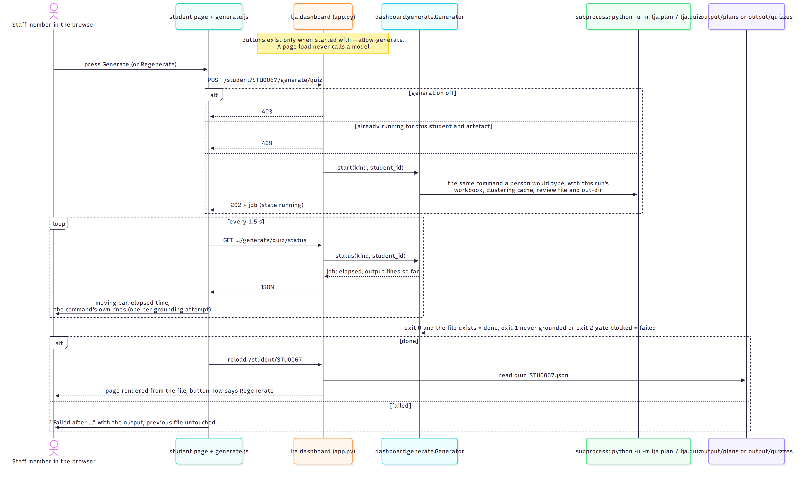

# Learning Journey Assistant — UML Use Case and Sequence Diagrams

| | |
|---|---|
| **Version** | 2.0, 3 October 2026. Supersedes the 11 August 2026 page, on which the left column was "built" and the right column "planned"; everything on it is now built, and the planned column has moved on. |
| **Describes** | `main` at `b4ccebd` (3 Oct 2026); the Generate button sequence is open PR #55 |
| **Source** | `docs/design/uml-use-case-and-sequence.md`; diagrams from `docs/handover/diagrams/02-*.mmd`, `03-*.mmd`, `04-*.mmd`, `05-*.mmd`, `09-*.mmd`. Rebuild with `docs/design/build.sh` |

## Who interacts with the system

There is no sign-in. "Student" and "subject coordinator" are roles the data is designed around, not roles the software enforces; the dashboard is bound to localhost and any viewer can open any student. The story codes (S, D, E) are the ones the System Maintenance Document's §2 traces into Jira and the test suite.

*Figure 1: Actors and use cases. Solid is built and on `main`; dashed is the planned follow-up. Source: `docs/handover/diagrams/02-use-cases.mmd`.*

| Actor | Can | Cannot yet |
|---|---|---|
| Subject coordinator | Review the AI's grouping before it drives a report; see the cohort split into priority groups; audit outcome wording, competencies, subjects and assessments; check the provenance of every number; generate a plan or quiz for one student from the page when that is switched on | Confirm clusters in the browser (the review is a CLI); see a Moodle-sourced run on the dashboard |
| Student | See understanding, strengths, gaps with evidence, progress along the subject sequence and where a weakness is assessed next; read a plan, a study strategy and a practice quiz once staff have reviewed them | Be shown an unreviewed quiz (by design); see "ahead" filtered to their own degree (needs the course map) |
| Project owner or researcher | Export pseudonymised CSVs with a manifest; reproduce any run from the Provenance page | Nothing further is gated; the open decisions are thresholds, the at-risk rule and the course map |
| Maintainer | Run everything from a clean clone offline via the reference run; build synthetic cohorts with an answer key and score the detector | |

## Class view

*Figure 2: The types a maintainer touches: the dataset, the clustering result and review store, thresholds and verdicts, trajectory, the three generated artefacts and the grounding report they all pass through, and the dashboard's generator and run record. Source: `docs/handover/diagrams/03-classes.mmd`.*

## Sequence: running the pipeline

*Figure 3: `python -m lja.cli`, including the cache branch that avoids re-spending a model call and the staff gate that can stop the run. Source: `docs/handover/diagrams/04-seq-pipeline.mmd`.*

## Sequence: generating a grounded artefact

*Figure 4: `python -m lja.plan`. The study strategy and the quiz follow the same sequence; their grounding is also per competency, and the quiz adds one blind educator-review call after the quiz grounds. Source: `docs/handover/diagrams/05-seq-learning-plan.mmd`.*

Why grounding is a separate step and not just schema validation: a live run produced a response that was perfectly shaped, valid JSON matching the schema, while silently missing 3 of 13 SILOs. Schema validation cannot see a data-completeness problem; only checking the response against the input can. The retry quotes every problem back to the model, and if no attempt grounds the command exits 1 and writes nothing.

## Sequence: generating from the dashboard

*Figure 5: The opt-in Generate button (PR #55). A page load never calls a model; a press runs the same CLI command as a subprocess with this run's inputs, and the page polls the job and re-renders from the file. Source: `docs/handover/diagrams/16-seq-generate-from-dashboard.mmd`.*

## What changed since the August page

| August 2026 | October 2026 |
|---|---|
| Three use cases built, three planned (view gap report, learning plan, quiz) | Eighteen built; the planned column is course-map filtering, a Moodle-sourced dashboard and sign-in |
| Two sequence diagrams: the CLI and the coverage failure | Four: the CLI, the artefact family, the dashboard button, plus the class view |
| "Review SILO mapping" was a planned staff gate on the criterion map | The gate is on the clustering, built, and shown as a banner with a link to the clusters page |
