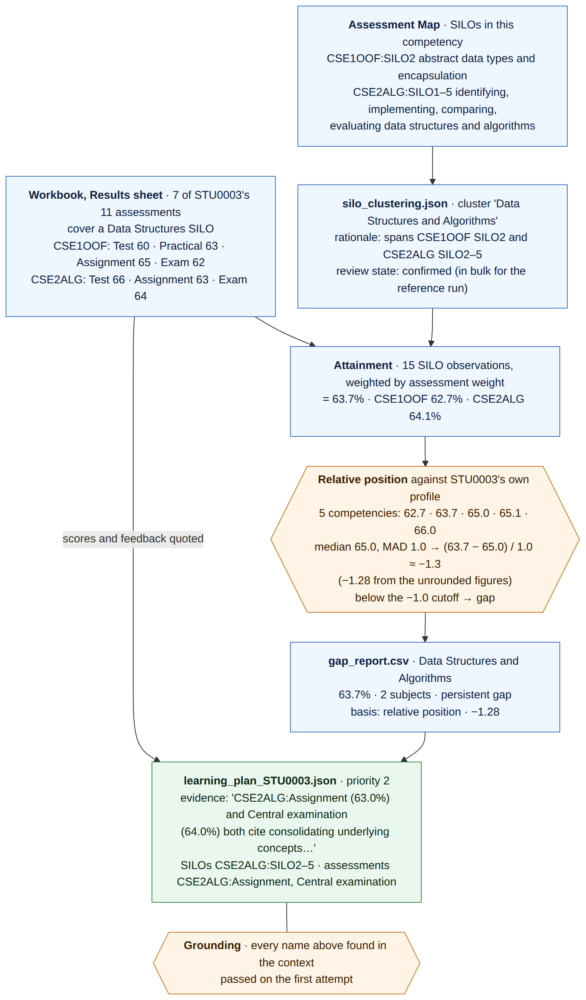

# Learning plans: the evidence behind every recommendation

**Purpose.** This document explains how a learning plan is built, shows that every statement in a
plan can be traced back to a student's marked work, and sets out why that traceability matters
educationally. It uses one real claim from the committed reference run as a worked example. The
trace can be re-checked from the files in the repository, with no LLM call.

**Audience.** The project owner, assessors of the project, and whoever maintains the system next.

---

## 1. The short version

A learning plan tells a student which competencies to work on and what to do. It is only useful if
the student and their tutor can ask "why does it say that?" and get a checkable answer. We built
the pipeline so each stage leaves a file behind, and each file is the input to the next. A claim
in a plan therefore has an unbroken chain back to specific marks, in specific assessments, against
specific learning outcomes:

1. **What was assessed.** The student's marks and marker feedback, and which subject intended
   learning outcomes (SILOs) each assessment covers.
2. **What it is evidence of.** Which cross-subject competency each SILO belongs to, with the
   reason, after staff review.
3. **Where the student stands.** Their attainment in each competency, whether that is a gap, and
   the basis for that verdict.
4. **What the model is shown.** Only this student's own evidence from steps 1 to 3.
5. **What the student reads.** A plan whose every named competency, SILO, subject and assessment
   has been checked against step 4. If a name is invented, the plan is rejected and never written.

Checks sit between the stages, so a broken link stops the pipeline rather than passing silently.

---

## 2. What we built: the evidence lineage


*Figure 1: Evidence lineage of a learning plan. Blue boxes are files a reader can open. Orange
shapes are checks that stop the pipeline when they fail. Source:
`docs/handover/diagrams/07-evidence-lineage.mmd`.*

| Stage | File a reader can open | What it records | Check before the next stage |
| --- | --- | --- | --- |
| 1. What was assessed | The workbook (`Results` and `Assessment Map` sheets) | Each student's score, weight and marker feedback per assessment, and the SILOs each assessment covers | None. This is the source. |
| 2. What it is evidence of | `silo_clustering.json` and `silo_clustering.review.json` | Each SILO's competency and the model's rationale, plus the staff decision on each cluster | Coverage: every SILO in exactly one competency, or the clustering is retried. Review: a rejected cluster stops everything downstream. |
| 3. Where the student stands | `gap_report.csv` | Attainment per competency, number of subjects evidencing it, the classification, **the basis for it**, and the relative position | The thresholds are configuration, recorded with the run, not hidden in code. |
| 4. What the model is shown | Rendered into the prompt | This student's gaps, per-subject figures and trend, SILO wording, own scores and feedback. No other student's data. | The allowed vocabulary for step 5 is built from exactly this. |
| 5. What the student reads | `learning_plan_<id>.json` and `.md` | Priorities naming competencies, SILOs, subjects and assessments, with evidence and actions. The Markdown ends with the evidence table the plan was grounded in. | Grounding: eight checks, including a scan of the prose for subject codes and SILO keys. On failure, retry with the errors quoted back. After three failures, exit 1 and write nothing. |

Two design choices make the chain hold.

- **The plan's schema carries references, not just prose.** Each priority has separate fields for
  its competency, SILO keys, subject codes and assessment keys. That gives the validator something
  concrete to check. The prose is also scanned, so "revise CSE9XYZ" inside a sentence is caught.
- **Every verdict records how it was reached.** A gap row says whether it came from the student's
  relative position, an absolute floor or ceiling, or too little data. A reader never has to guess
  why a competency was called a gap.

The process view of the same steps, with the retry loop and exit codes, is Figure 5 in the
system maintenance document.

---

## 3. A worked trace: one claim, back to the marks

The claim is priority 2 of the committed plan
`data-fixtures/reference-run/plans/learning_plan_STU0003.json`: **Data Structures and Algorithms is
a gap for STU0003**. Its evidence text reads: *"CSE2ALG:Assignment (63.0%) and Central examination
(64.0%) both cite 'consolidating underlying concepts'…"*.



*Figure 2: Tracing one learning-plan claim for STU0003 back to the workbook. Every value is taken
from the committed reference run. Source: `docs/handover/diagrams/08-trace-stu0003.mmd`.*

Step by step, from the source upwards:

1. **Marks.** Seven of STU0003's eleven assessments cover at least one SILO in this competency:
   four in CSE1OOF and three in CSE2ALG. The CSE2ALG Assignment scored 63 with weight 0.3, and the
   Central examination scored 64 with weight 0.5, as the plan quotes.
2. **Outcomes.** The competency groups CSE1OOF:SILO2 ("abstract data types and encapsulation…")
   with CSE2ALG:SILO1 to SILO5 ("identifying… implementing… comparing… data structures and
   algorithms"). The clustering's rationale says so in words, and the cluster is marked confirmed.
3. **Attainment.** Counting each SILO an assessment covers as one observation gives 15
   observations. Their weighted mean is 63.7%. By subject, it is 62.7% in CSE1OOF and 64.1% in
   CSE2ALG.
4. **Verdict.** STU0003's five competencies sit at 62.7, 63.7, 65.0, 65.1 and 66.0. The median is
   65.0 and the median absolute deviation (MAD) is 1.0. Data Structures is therefore about 1.3
   MADs below the student's own median: −1.28 from the unrounded figures. That is past the −1.0
   cutoff, so it is a gap. It shows in two subjects, so it is a **persistent** gap. The gap report
   records all of this, including "basis: relative position".
5. **Plan.** The model was shown only STU0003's evidence. Its priority names CSE2ALG:SILO2 to SILO5
   and two CSE2ALG assessments, and quotes their scores. The grounding check found every name in
   the context, and the plan passed on its first attempt.

**Re-checking it yourself.** From `python/` on main, with no LLM:

```bash
R=../data-fixtures/reference-run
python -m lja.cli ../data-fixtures/CSE_results_150_students_3_Subjects.xlsx --clustering-cache $R/silo_clustering.json
grep STU0003 output/gap_report.csv          # the verdict, its basis and relative position
grep -A3 '"Data Structures and Algorithms"' $R/silo_clustering.json   # the cluster and rationale
cat $R/plans/learning_plan_STU0003.md      # the plan, ending with its evidence table
```

The pipeline reproduces the committed `gap_report.csv` exactly, so the verdict in step 4 is not a
one-off.

---

## 4. Why this matters educationally

**It keeps advice aligned with what the subject intends to teach.** Constructive alignment (Biggs,
1996) holds that intended outcomes, teaching activities and assessment should point at the same
thing. The plan is built along that alignment in reverse. It starts from marks, goes through the
assessments that produced them, and reaches the intended outcomes those assessments were designed
to test. So a recommendation is about a named outcome the student was meant to achieve, not a
generic "study harder". A student told to work on CSE2ALG:SILO4 can open the subject guide and read
exactly what that outcome asks of them.

**It answers the three questions good feedback answers.** Hattie and Timperley (2007) frame
effective feedback as answering *where am I going?*, *how am I going?* and *where to next?*. The
SILO wording answers the first. The student's own figures and marker comments answer the second.
The plan's actions answer the third. Because each answer is traceable, the student can see that
the "how am I going" part is about their work, not a model's impression of it. Nicol and
Macfarlane-Dick (2006) argue that feedback should help students self-regulate: clarify what good
performance is, and give information they can act on. A claim the student can follow back to a
specific assessment is one they can act on.

**It judges students against themselves, not against a pass mark.** The verdict in step 4 compares
a competency with the student's own profile. That is a formative signal about where this student's
relative weakness lies, not a ranking. It is also why the tender asked for relative detection
"rather than raw pass or fail thresholds". Recording the basis of every verdict means a student at
65% is never quietly told the same thing as a student at 35%, and a reader can see which kind of
statement they are looking at.

**It lets students and staff question the system.** Learning analytics raises questions of
transparency, consent and student agency (Slade and Prinsloo, 2013). Students should be able to
understand, and challenge, what is inferred about them. A plan that can be traced is a plan that
can be contested: a student or tutor who disagrees with a claim can find the exact mark, outcome,
competency grouping and threshold behind it, and point to the link they think is wrong. That
matters more, not less, when a language model writes the text. The grounding check guarantees the
model named nothing that was not in the student's own evidence.

**It gives staff a curriculum signal, not just a student signal.** A persistent gap spans subjects.
When many students share one, the trace leads to the SILOs and assessments involved, across subject
boundaries. That is evidence for a conversation about how an outcome is taught or assessed, which a
single subject's results cannot show. The outcome-quality views build on the same links.

**It is what the tender promised.** Requirement 5 asks that a displayed figure be traceable to its
source. Requirement 6 asks that generated content name only SILOs, subjects, assessments and
competencies present in the input, and that the build fail otherwise. The lineage in Figure 1 is
how both are met, and Figure 2 is the evidence.

---

## 5. What the trace also shows (honest findings)

Tracing a real claim end to end surfaced four things a summary would hide.

- **The plan narrowed a persistent gap to one subject.** The gap engine found Data Structures weak
  in both CSE1OOF and CSE2ALG. The plan's priority names only CSE2ALG. Grounding proves every name
  is real, not that the argument is complete. The study-strategy feature (IOLG-123, PR #26) closes
  this for strategies: a persistent-gap entry must name at least two of the subjects that evidence
  it, or it is rejected. The same rule could be added to plans.
- **On the supplied data, the differences are tiny.** STU0003's whole profile spans 62.7% to 66.0%.
  A relative position of −1.28 here means 1.3 marks below the student's own median. The trace
  proves the mechanism, not that this gap matters educationally. This is the flat-profile finding
  in `docs/adr/0001-relative-gap-detection.md`: the supplied workbook has no per-competency
  variation by construction. The 5000-student synthetic cohort does, and there the same chain
  separates planted gaps from noise (see `data-fixtures/README-handbook-cohort.md`).
- **"Confirmed" in the reference run is not a staff decision.** The reference run confirms its
  clusters in bulk so the pipeline runs offline. The review file records the state faithfully, but
  a real deployment needs staff to make that decision (IOLG-124).
- **Feedback in the supplied data is templated.** Most of STU0003's marker comments share the same
  sentence ("needs greater consistency of the relevant learning themes"). The plan quotes it
  accurately, but it adds little. With real marker feedback, this link in the chain carries far
  more weight.

One small inconsistency is worth recording for maintainers. The overall attainment counts one
observation per SILO, while the per-subject breakdown counts one per assessment. For STU0003 in
CSE2ALG this gives 64.1% in the breakdown against 64.0% if counted per SILO. Neither changes the
verdict.

## 6. Limits of what traceability proves

- **Existence, not correctness.** Grounding shows every name came from the evidence. It cannot show
  that the reasoning is sound or the tone is right. The human audit of ten plans (IOLG-121) covers
  that.
- **The competency grouping is a judgement.** It is made by a model and confirmed by staff.
  Traceability makes the grouping visible and reviewable. It does not make it right.
- **One claim was traced by hand.** The files make any claim traceable, but this document walks
  through one. Generating a trace table automatically beside every plan would be a small extension.

## References

- Biggs, J. (1996). Enhancing teaching through constructive alignment. *Higher Education*, 32(3),
  347–364.
- Hattie, J., & Timperley, H. (2007). The power of feedback. *Review of Educational Research*,
  77(1), 81–112.
- Nicol, D. J., & Macfarlane-Dick, D. (2006). Formative assessment and self-regulated learning: a
  model and seven principles of good feedback practice. *Studies in Higher Education*, 31(2),
  199–218.
- Slade, S., & Prinsloo, P. (2013). Learning analytics: ethical issues and dilemmas. *American
  Behavioral Scientist*, 57(10), 1510–1529.
