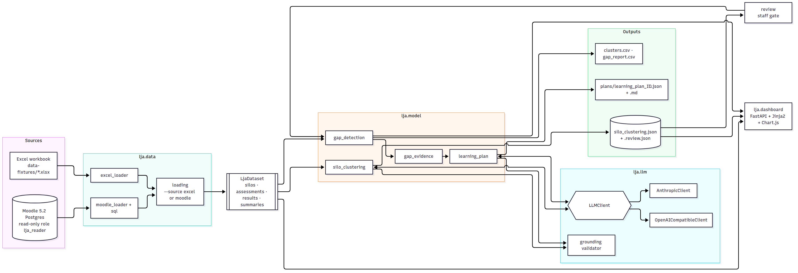
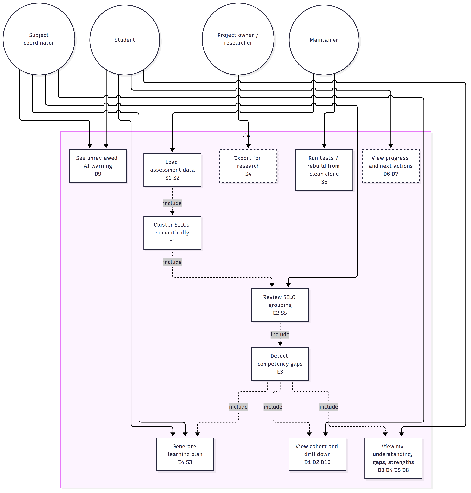
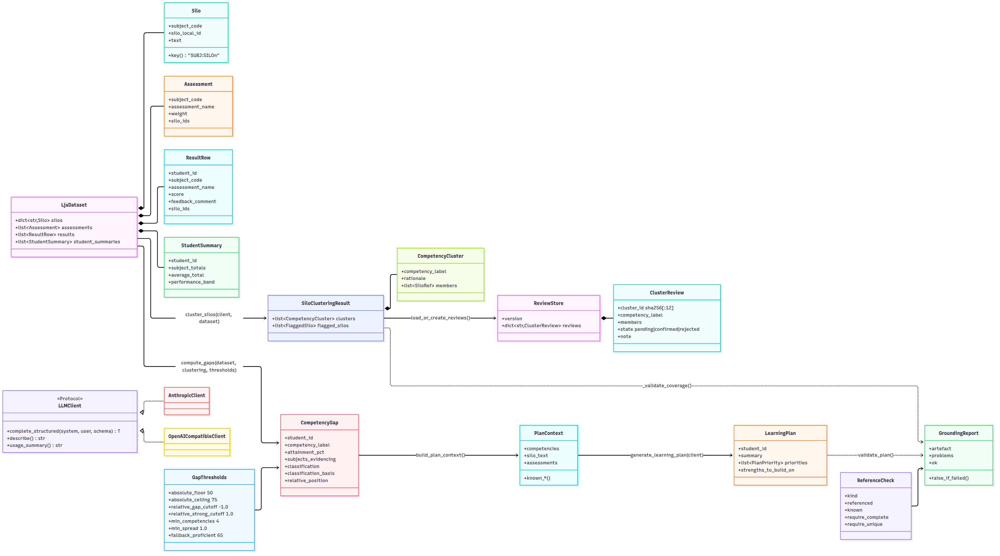
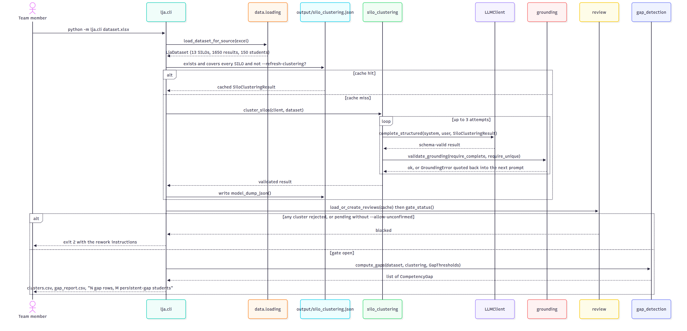
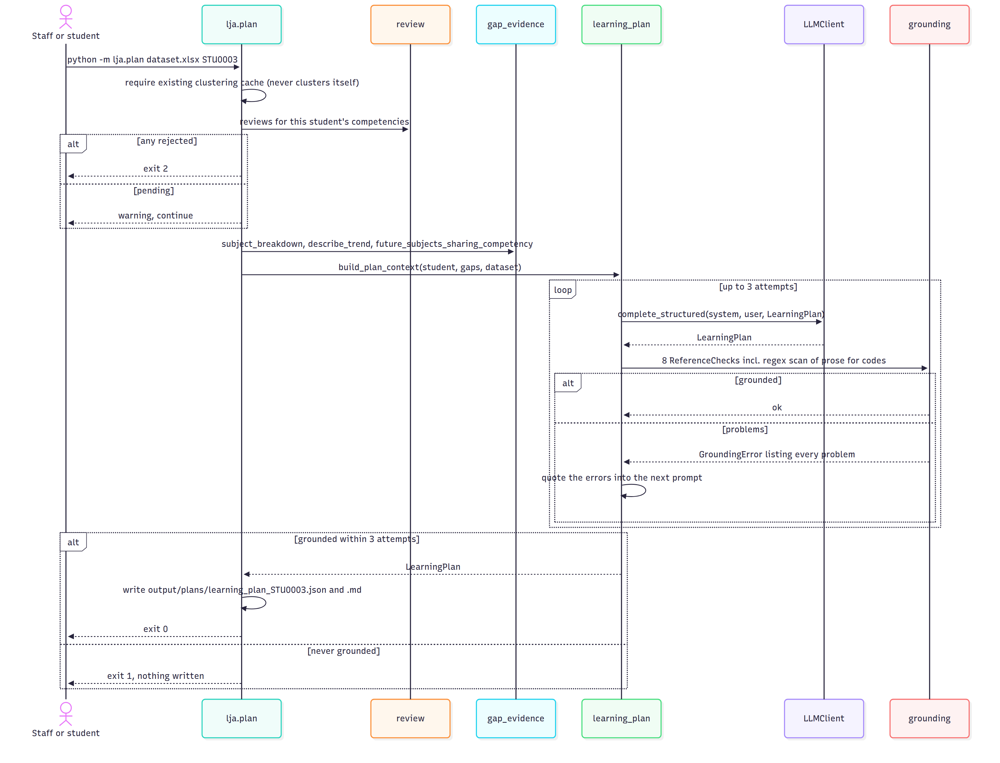
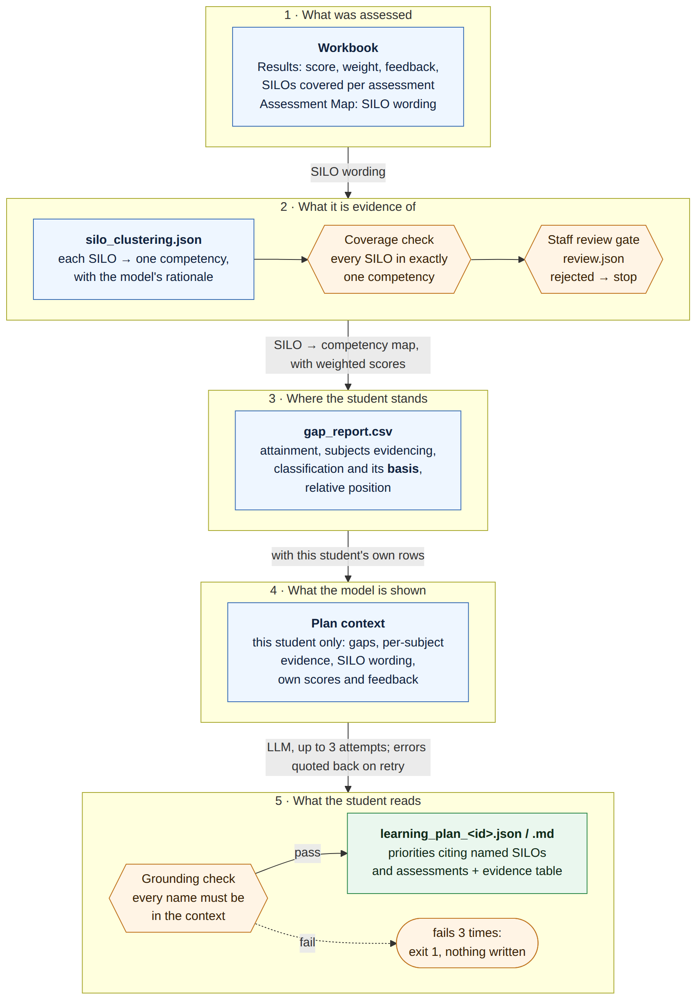
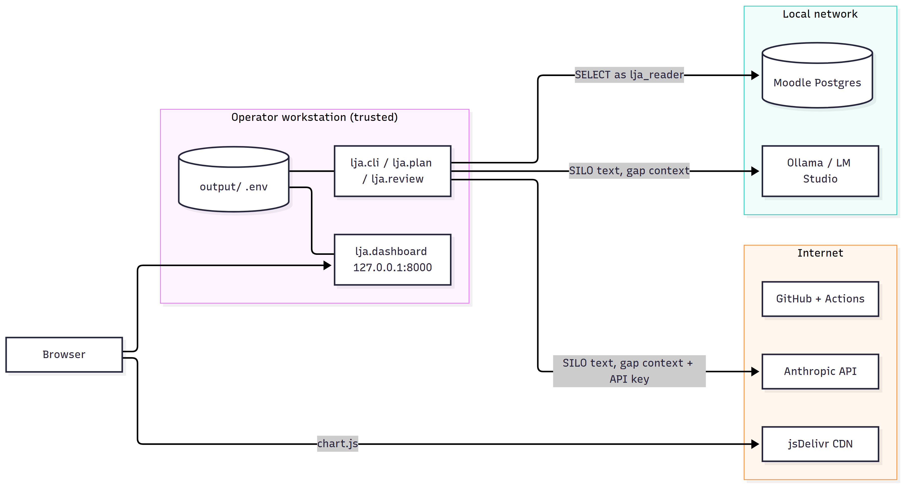

# Learning Journey Assistant — System Maintenance Document

| | |
|---|---|
| **Status** | DRAFT 0.2 — for team review. Sections marked ⚠ *TO FILL* depend on Sprint 5/6 evidence that does not exist yet. |
| **Date** | 27 September 2026 |
| **Describes** | `main` at `ac75a8e` (23 Sep 2026) plus the four open pull requests #22–#25, which are labelled where they matter |
| **Project** | CSE5IDP Industry Development Project, Semester 2 2026, La Trobe University, Group 3 (Jira project IOLG) |
| **Project owner** | Dr Scott Mann |
| **Team** | Allan Campton (architecture, data model, gap engine), Ayesha Mosaddeque (CI, security scanning, Moodle extraction), Istiaque Bhuiyan (LLM layer, grounding, generation), Anup Tumbalam Gooty (QA, acceptance verification), Sui Lung Tang (risk, dashboard views) |
| **Repository** | https://github.com/yetanotherpassword/LearningJourneyAssistant |
| **Companion documents** | Repository `README.md` (quick start), the User Document (end-user walkthrough of the dashboard and CLI), the two ADRs under `docs/adr/`, the tender (`Tender Document.docx`) |

---

## How to read this document

This document is written for whoever inherits the Learning Journey Assistant (LJA): the project owner, or the team that picks the system up next semester. It assumes you can read Python and run a terminal, but nothing about this codebase.

The user stories in §2 are the thread that runs through the whole document. Every story carries the same identifier in the design (§3), the deployment steps (§4), the test table (§6) and the usability trial (§7), so you can pick any story and follow it from requirement to code to evidence.

The diagrams in §3 are images under `docs/handover/diagrams/`, rendered from the Mermaid source files beside them. To change a diagram, edit the `.mmd` file and re-render with `npx -y @mermaid-js/mermaid-cli -i diagrams/NAME.mmd -o diagrams/NAME.png --size 1800 -s 2`.

If you only have ten minutes: read §1, then §4.3 (clean-clone install), then §5.1 (the repository map). If the system is broken, go to §5.6 (troubleshooting).

Every figure the system calculates or displays is defined in Appendix B, with its formula, where it is calculated and shown, and the status of any threshold it uses.

---

## 1. System overview

### 1.1 What LJA does

LJA reads students' assessment results, works out which subject intended learning outcomes (SILOs) across *different* subjects describe the same underlying competency, and then measures each student against each competency **relative to that student's own profile**, not against a fixed pass mark. Where a student is weak in a competency across more than one subject, LJA calls that a *persistent gap*. A read-only dashboard shows the cohort and each student; a separate command generates a learning plan for one student that is validated, name by name, against the data it was built from.

The problem it addresses, from the tender: students "lack a reliable way to understand what they have mastered, where gaps persist, why those gaps matter for later subjects, and what they should study next", and teaching staff "have no aggregated view of where a cohort is weak against SILOs".

### 1.2 What exists today

| Capability | State on `main` (23 Sep 2026) |
|---|---|
| Load results from the project owner's Excel workbook | Working |
| Load results from a Moodle 5.2 database (rubric fills, read-only role) | Working for one seeded subject (CSE1IOI) |
| Semantic clustering of SILOs into cross-subject competencies via an LLM, with coverage validation and retry | Working |
| Staff confirmation gate on the clustering (pending / confirmed / rejected) | Working (CLI) |
| Relative gap detection (median/MAD within each student's profile, with absolute guards) | Working; threshold values documented but not ratified |
| Dashboard: cohort list, statistics, cohort drill-down, per-student gaps with evidence, unreviewed-AI banner | Working |
| Dashboard: strengths view and student picker | Open PR #23 |
| Dashboard: competency clusters page | Open PR #25 |
| Dashboard: progress view, recommended next actions | Not built |
| Grounded learning plan for one student (fails closed on any invented name) | Working |
| Study-strategy recommendations, adaptive quizzes | Not built (quizzes descoped) |
| Longitudinal / A-B research export | Not built (Sprint 5 work) |
| Synthetic cohort generator from a YAML subject catalogue, with ground truth | Open PR #24 |
| Committed reference run so the pipeline and dashboard work offline | Open PR #22 |
| CI: lint, tests, secret scan, dependency audit; branch protection on `main` | Working |

### 1.3 Guardrails the system is built around

These come from the tender and the project owner and shape most of the design decisions in §3.7:

- AI recommendations never override academic grading; mastery estimates are formative indicators, not official evaluations.
- Every AI output is grounded in structured subject data. The LLM is never allowed to invent a SILO, subject, assessment or competency, and the code enforces this rather than trusting the prompt.
- No real student data is used. Every student in the repository is synthetic (`STU0001`…) or from the anonymised, modelled workbook the owner supplied.
- Local-first. The Moodle instance, the pipeline and (optionally) the LLM run on hardware under the team's control. Cloud migration is deferred, not forbidden.
- Least privilege everywhere: a read-only database role, a four-function web-service token, no admin credentials, secrets never committed.
- Nothing ever writes to Moodle tables.

---

## 2. User stories: the thread

The stories below are the ones the team agreed for the Sprint 5 user acceptance test (UAT). `S` stories exercise the command line, `D` stories the dashboard. Four engine-level stories (`E`) are added here because they carry the algorithmic requirements that the `S` and `D` stories depend on. Tender requirement numbers (R1–R12) and Jira keys are given so the thread can be followed into the board.

| ID | As a… | I want… | so that… | Tender | Jira | Status |
|---|---|---|---|---|---|---|
| **E1** | subject coordinator | SILOs from different subjects grouped by the competency they actually describe, not by keyword | a gap in first year can be linked to its consequence in third year | R2, R3 | IOLG-82, IOLG-109 | Done |
| **E2** | subject coordinator | to confirm or reject the AI's grouping before it drives any report | no gap report is produced from unreviewed AI output without saying so | R3, R6 | IOLG-82, IOLG-115, IOLG-116 | Done |
| **E3** | student | my weak competencies identified relative to my own profile, with an absolute floor and ceiling | a strong student's weakest area and a weak student's uniform weakness are both surfaced | R4 | IOLG-86 | Done; thresholds unratified |
| **E4** | student | a learning plan whose every named subject, SILO and assessment is one I actually have | the AI cannot hallucinate advice | R6 | IOLG-85, IOLG-108 | Done |
| **S1** | team member | to run the pipeline on the supplied workbook | a gap report is produced from a clean clone | R11 | IOLG-78, IOLG-118 | Done |
| **S2** | team member | to run the pipeline on a live Moodle database | the production data path is proven | R1 | IOLG-104, IOLG-105, IOLG-56 | Done for one subject |
| **S3** | student / staff | to generate one student's learning plan | the student gets grounded next-step advice | R6 | IOLG-108, IOLG-119 | Done |
| **S4** | researcher | to export results as CSV with a manifest | longitudinal and A/B evaluation is possible | R7 | IOLG-120 | Not built |
| **S5** | staff | a rejected cluster to change what the dashboard shows | reviewers can see that a review had effect | R3 | IOLG-116 | Done |
| **S6** | maintainer | the test suite to pass | I know the install is healthy | R11 | IOLG-80 | Done |
| **D1** | staff | to see the whole cohort with gap counts and sortable columns | I can find who needs attention | R5 | IOLG-83 | Done |
| **D2** | staff | to drill into a cohort and be told what put each student there | every figure is traceable | R5 | IOLG-83 | Done |
| **D3** | student | to see my understanding per competency as a chart | I know where I stand | R5 | IOLG-83 | Done |
| **D4** | student | to see my strengths with their basis | I know what to build on | R5 | IOLG-112 | Open PR #23 |
| **D5** | student | to see each gap with per-subject evidence | the gap is explained, not just labelled | R5 | IOLG-83 | Done |
| **D6** | student | to see progress across subjects | I can see whether a gap is closing | R5 | IOLG-107 | Not built |
| **D7** | student | recommended next actions from my learning plan on the dashboard | the plan is where I look | R5, R6 | IOLG-122 | Not built |
| **D8** | any user | to switch student from the header | navigation is quick | R5 | IOLG-112 | Open PR #23 |
| **D9** | any user | to know when the AI grouping is unreviewed, and click through to see which clusters | I do not trust an unreviewed report | R6 | IOLG-116, IOLG-131 | Done; click-through in PR #25 branch |
| **D10** | staff | to name the source record behind any number | the dashboard is auditable | R5 | IOLG-83 | Done |

Descoped and never started: adaptive quiz generation (R8). See §8.

---

## 3. Design and implementation

### 3.1 Architecture

LJA is a Python 3.12 package (`python/lja/`) that runs in place, not pip-installed. It has four layers, and data flows through them in one direction.



*Figure 1: LJA architecture: sources, data layer, LjaDataset, model layer, LLM layer, outputs, dashboard. Source: `docs/handover/diagrams/01-architecture.mmd`.*

Two things about this picture matter more than the rest:

1. **`LjaDataset` is the single interchange type.** Both loaders produce it and everything downstream consumes it. When the Moodle path was added in Sprint 4, `silo_clustering.py` and `gap_detection.py` did not change. A third source (a different LMS, a CSV) only needs a loader.
2. **The LLM only ever sees structured data, and its output is checked against the input.** The clustering call sees SILO text; the plan call sees the gap classification and evidence. Neither sees raw Moodle text, and both are validated by the grounding module before anything is written.

### 3.2 Technology stack

| Layer | Choice | Version (pinned in `requirements.txt`) | Why |
|---|---|---|---|
| Language | Python | 3.12 | Team skills; the owner's brief asked for Python LLM integration; `psycopg2`, `pandas`, `openpyxl` cover both data paths |
| Data models | Pydantic v2 + frozen dataclasses | pydantic 2.13.4 | Pydantic gives schema-validated LLM output (`extra="forbid"`); dataclasses keep the internal dataset immutable |
| Excel loading | openpyxl / pandas | 3.1.5 / 3.0.5 | Owner supplied `.xlsx`; no need for anything heavier |
| Moodle access | Direct SQL over psycopg2, plus Moodle Web Services REST for discovery | 2.9.12 | Rubric fills are not exposed over Web Services (see §3.7 D3) |
| LLM, cloud | Anthropic SDK, model `claude-opus-4-8` | anthropic 0.121.0 | Native structured output enforced server-side |
| LLM, local | Any OpenAI-compatible server (Ollama, LM Studio, llama.cpp), default model `qwen3-vl:30b` | openai 2.53.0 | Zero-cost default; a fresh clone works without an API key |
| Web dashboard | FastAPI + Jinja2 + uvicorn | 0.141.1 / 3.1.6 / 0.52.1 | Small, read-only, server-rendered; no build step, no JS framework to maintain |
| Charts | Chart.js 4 from the jsDelivr CDN | 4.x | Adequate for bar and doughnut charts; **not vendored, so charts need internet** (§5.7) |
| Dev Moodle | `moodlehq/moodle-docker`, Moodle 5.2, PostgreSQL | 5.2.2 verified | Official tooling; local-first per the owner |
| Environment | conda (`python/environment.yml`) or pip (`requirements.txt`) | — | conda for developers; pinned pip for CI reproducibility |
| Lint / test | ruff 0.16.4, pytest 9.1.1, pytest-cov | pinned | ruff pinned so a new rule cannot redden an unrelated PR |
| Security scanning | gitleaks 8.18.4 (full history), pip-audit | pinned | Tender R9 names secret scanning as Mandatory |
| CI | GitHub Actions | — | Three independent jobs; branch protection enforced for admins |

### 3.3 Use case diagram

Actors and use cases as they stand today. Dashed use cases are planned or in an open PR.



*Figure 2: Use case diagram: actors and use cases, dashed = planned. Source: `docs/handover/diagrams/02-use-cases.mmd`.*

Note on actors: there is no authentication. The dashboard is bound to `127.0.0.1` and any viewer can open any student. "Student" and "subject coordinator" are roles the *data* is designed around, not roles the *software* enforces. See the threat model (§3.8).

### 3.4 Class diagram

The classes below are the ones a maintainer will touch. Field lists are abbreviated; the source line for each is in the architecture inventory in §5.1.



*Figure 3: Class diagram of the main LJA types. Source: `docs/handover/diagrams/03-classes.mmd`.*

### 3.5 Sequence diagrams

**Running the pipeline (S1, E1, E2, E3).** What `python -m lja.cli dataset.xlsx` does, including the cache branch that avoids re-spending an LLM call on every run and the staff gate that can stop it.



*Figure 4: Sequence diagram: running the pipeline. Source: `docs/handover/diagrams/04-seq-pipeline.mmd`.*

**Generating a grounded learning plan (E4, S3).** Why grounding is a separate validation step and not just Pydantic schema validation: a live run produced a response that was perfectly shaped, valid JSON matching the schema, while silently missing 3 of 13 SILOs. Schema validation cannot see a data-completeness problem; only checking the response against the input can.



*Figure 5: Sequence diagram: generating a grounded learning plan. Source: `docs/handover/diagrams/05-seq-learning-plan.mmd`.*

**Tracing a plan's evidence (E4, requirements 5 and 6).** Figure 5 shows the process. Figure 5b shows the evidence lineage instead: the file each stage leaves behind and the check between stages, so any statement in a plan can be followed back to specific marks, assessments and SILOs. The companion document, `docs/handover/learning-plan-traceability.md`, walks one real claim from the reference run back to the workbook. It also explains why this traceability matters educationally and what the trace exposed.



*Figure 5b: Evidence lineage of a learning plan. Source: `docs/handover/diagrams/07-evidence-lineage.mmd`.*

### 3.6 Data model and file formats

**Input workbook** (`data-fixtures/CSE_results_150_students_3_Subjects.xlsx`, supplied by the owner on 11 Aug 2026): three sheets.

| Sheet | Columns (essential) | Becomes |
|---|---|---|
| Assessment Map | Subject, Assessment, Weight, Contribution, Early, Hurdle, SILOs (semicolon list, so SILO text must not contain `;`) | `Assessment`, `Silo` |
| Results | Student ID, Subject, Assessment, Score, Feedback, Weight, Weighted score, SILOs | `ResultRow` |
| Student Summary | Student ID, per-subject totals, Average total, Performance band | `StudentSummary` |

**Moodle path**: SQL Query 2 in `sql/moodle_attainment_extraction.sql` (templated on `{prefix}`) returns one row per (student, assessment, rubric criterion) with the level awarded, the criterion's maximum and the marker's remark. The loader joins those rows to a staff-editable CSV `criterion_silo_map_<SUBJECT>.csv` (`subject, assessment, criterion_text, silo_key, weight`). An unmapped criterion is a hard error. This mapping CSV **is the product**, not a workaround: Moodle's own Outcomes (Query 3) and Competency framework (Query 4) tables were both empty for the seeded subject.

**Generated files** (all under `python/output/`, gitignored):

| File | Producer | Format | Notes |
|---|---|---|---|
| `silo_clustering.json` (`silo_clustering_moodle.json` for `--source moodle`) | `lja.cli` | `SiloClusteringResult` JSON | The LLM cache. Regenerable. Delete or `--refresh-clustering` to re-cluster. |
| `silo_clustering.review.json` | `lja.review` / `lja.cli` | `ReviewStore` JSON | **Staff decisions. Not regenerable.** Cluster ids are the first 12 hex chars of SHA-256 over the sorted member keys, so a re-clustering that produces the same membership keeps its decision. |
| `clusters.csv` | `lja.cli` | CSV | Cluster table plus SILO definitions |
| `gap_report.csv` | `lja.cli` | CSV | `student_id, competency_label, attainment_pct, subjects_evidencing, n_observations, classification, classification_basis, relative_position` |
| `plans/learning_plan_<id>.json`, `.md` | `lja.plan` | `LearningPlan` JSON, Markdown | Only written after grounding passes |

**Classification vocabulary** (`gap_detection.py`): `classification` ∈ {persistent gap, isolated gap, developing, proficient}; `classification_basis` ∈ {relative position, absolute floor, absolute ceiling, insufficient data}. Persistent means evidenced in two or more subjects. The basis column exists for traceability (R5): every label says which rule produced it.

### 3.7 Design decisions and their justification

Each decision names the quality it serves. Scalability, flexibility, usability and limitations are addressed in each, as the Week 9 lecture asked.

**D1. Standalone system beside Moodle, not a Moodle plugin (tender Option 2).** The only option that delivers every must-have inside a semester while keeping identifiable data out of scope. The extraction layer is behind an interface, so Option 3 (a plugin that exposes rubric fills as a web service) stays open. *Flexibility.* Limitation: an institution has to run a second service.

**D2. Two data paths into one `LjaDataset`.** The Excel path exists because the owner supplied a ready-extracted workbook and the team could build the algorithmic core without waiting on Moodle plumbing. The Moodle path is the production path. Proof that the abstraction holds: `--source moodle` was added with no change to clustering or gap detection. *Flexibility, scalability of the team.* Limitation: the Moodle loader is proven on one subject with five students; multi-subject extraction is future work.

**D3. Rubric fills are read from the database, not Web Services. Stated plainly, as the owner asked.** Moodle's Web Services expose a rubric's *definition* (criteria and levels) but no function returns which level a marker *awarded* or their per-criterion remark. Those live in `gradingform_rubric_fillings`, so the production path connects to PostgreSQL as a read-only role and runs Query 2. Consequences for an operator: LJA needs a database credential, not just a token; the connection must be to a replica or with a role that can only `SELECT`; and any Moodle upgrade that changes the `grading_instances`/`assign_grades` join must be re-verified (§5.8). *Limitation accepted deliberately.*

**D4. Provider-agnostic LLM layer, defaulting to a free local model.** One `LLMClient` protocol, two native implementations. Feature code never imports `anthropic` or `openai`. The default is `openai_compatible` so a fresh clone runs with no API key. Justification from the tender: a governance decision about which provider the university permits "changes configuration rather than architecture". *Flexibility.* Limitation: local model quality varies enormously (§3.9).

**D5. Direct LLM clustering rather than an embedding pre-pass (ADR 0002, accepted 20 Sep 2026).** With 13 SILOs an embedding model, vector store, similarity threshold and retrieval stage add moving parts without adding accuracy. This is a recorded deviation from the tender, which promised "embeddings with LLM adjudication". The ADR names the reconsideration triggers: SILO count grows substantially, prompt size or latency become a problem, or consistency stays inadequate. The 52-SILO run on 20 Sep hit the first trigger (§3.9), so this decision is due for review. *Simplicity now, scalability later.*

**D6. Grounding is code, not prompt.** The prompt forbids inventing names; the grounding module (`lja/llm/grounding.py`) checks the response against the input vocabulary and raises. Three categories: `unknown` (always), `missing` (when completeness is required, as for clustering), `duplicated` (when uniqueness is required). Names are compared exactly after `strip()`, no case folding, no aliasing, because a fuzzy match is how a hallucination gets through. Plans fail closed: three attempts, errors quoted back, then exit 1 with nothing written. *Usability for the student, who can trust every name; limitation is that bare `SILO1` ids in prose pass as ambiguous.*

**D7. Staff gate before any gap report.** Clustering output is treated as `mapped_by='llm', confirmed_by_staff=False` until a person says otherwise. Decisions live in a separate `.review.json` so regenerating the cache never discards them. The CLI blocks (exit 2) on any rejected cluster, and on pending ones unless `--allow-unconfirmed` is passed; the dashboard shows a banner. The team settled "block, don't warn" by merging PR #8. *Usability for staff; a limitation is that the review is CLI-only, there is no confirmation UI.*

**D8. Relative gap detection with median and MAD (ADR 0001).** The owner's primary signal is "variability within a discipline, not raw failure". Position = (attainment − student's median) / MAD. Median and MAD rather than mean and SD because a student carries roughly 4–8 competencies and at that n one catastrophic result drags the mean far enough to hide everything else. Absolute floor (50) and ceiling (75) are checked first so a uniformly weak student still gets gaps and a uniformly strong one gets none. Fallbacks (too few competencies, flat profile) are recorded in `classification_basis`. **Every threshold is an environment variable and every default is a documented proposal, not a ratified value**: the owner confirmed there is no institutional at-risk number. *Usability for the student; limitation is that the supplied dataset is nearly flat (§3.9).*

**D9. Dashboard is read-only and never calls the LLM.** A page load must never trigger a billed API call. The app is a `create_app(dataset, gaps, clustering, review_warning)` factory; everything is computed at start-up from the cache. Statistics are population statistics computed in `stats.py`; sorting is progressive enhancement in 83 lines of vanilla JS. *Usability, cost control.* Limitation: no auto-reload, no auth, Excel source only.

**D10. Generated artefacts are separate commands.** `lja.plan` is not part of `lja.cli` so that re-running the pipeline never silently re-spends plan calls. *Cost control.*

**D11. The "At Risk" cohort is deliberately absent.** `/cohort/at-risk` returns 404 and a test asserts that. An at-risk rule would be a policy decision the owner has not made; shipping one would look like one. *Limitation by design.*

**D12. CI gates are honest about what they enforce.** Coverage is reported, not gated (the 80% tender target is met on the core modules but not on two CLI entry points); `pip-audit` reports but does not block (its result depends on the CVE feed, not the diff); line length is measured but not enforced. Each is written down with the condition for tightening it. *Maintainability: "a threshold that fails on the day it lands is a threshold somebody deletes by the end of the week."*

**D13. Assessment score counts as full evidence for every SILO it addresses.** Weighted only by the assessment's weight. This is an approximation, flagged for the owner, because the workbook does not carry per-SILO marks within an assessment. The Moodle path's per-criterion rubric fills are the way past it. *Limitation.*

### 3.8 Threat model

⚠ *DRAFT.* No threat model exists in the repository yet; this section is a first pass for the team to review and for Sprint 5's security evidence task (IOLG-111) to confirm. It uses STRIDE over the system's trust boundaries.

**Assets.** (1) Student assessment data, synthetic today but real if the system is deployed. (2) The Moodle database credential and web-service token. (3) The LLM API key. (4) The staff review file, because a tampered review file silently opens the gate. (5) Generated plans, which students act on. (6) The repository and CI, because a compromised dependency runs in every developer's environment.

**Trust boundaries.**



*Figure 6: Trust boundaries: workstation, local network, internet. Source: `docs/handover/diagrams/06-trust-boundaries.mmd`.*

| Threat (STRIDE) | Where | Control in place | Gap / recommendation |
|---|---|---|---|
| **Spoofing** a viewer | Dashboard | Bound to `127.0.0.1` by default; no accounts | No authentication. Never bind `--host 0.0.0.0` on a shared network with real data. Auth is future work. |
| **Tampering** with the review file | `output/*.review.json` | Separate from the cache; state machine forbids flipping confirmed→rejected directly | File is plain JSON with no signature. Keep `output/` on an operator-only path; consider a hash in the file. |
| **Tampering** with Moodle | Postgres | Role `lja_reader` is `SELECT`-only; nothing in the code issues a write; fixtures mark via `assign::save_grade()` | Role creation is documented but "never applied or proven" on a shared instance. IOLG-111 records the `UPDATE … permission denied` test and a `pg_dump` checksum before/after a run. |
| **Repudiation** of a staff decision | Review file | `note` field; git history if committed | No reviewer identity or timestamp is stored. Add `reviewed_by` and `reviewed_at`. |
| **Information disclosure** to the LLM provider | Anthropic path | Prompts carry SILO text and gap classifications, never raw feedback or names beyond `STU0001`-style ids | With real data, ids plus per-subject scores are re-identifiable. Pseudonymise at ingest before any cloud provider is used (owner NFR-2, FR-1.5). Prefer the local provider for real data. |
| **Information disclosure** via secrets | `.env`, CI | `.env` gitignored; gitleaks over full history, blocking; workflow permissions `contents: read` | Rotate any token that was ever pasted into chat or a ticket. |
| **Information disclosure** via logs | CLI output | Usage summaries print token counts, not content | Plans print to stdout in `.md`; do not pipe to shared logs with real data. |
| **Denial of service** by a hung LLM server | OpenAI-compatible client | Three `response_format` strategies each with a 600 s timeout | A hung server can burn 30 minutes and misreport as a JSON error (action A-30). Add `LJA_OPENAI_TIMEOUT`. |
| **Elevation of privilege** via dependencies | `requirements.txt` | Pinned versions; `pip-audit` in CI | `pip-audit` is non-blocking. Triage and flip `continue-on-error` to `false` (§5.4). |
| **Supply chain** via the CDN | `base.html` | None | Chart.js is fetched unpinned from jsDelivr at page load. Vendor it under `static/` and pin the version (A-20). |
| **Misuse** of threshold flags as a grade-changing tool | CLI `--absolute-floor` etc. | Output says which basis produced each label | If thresholds become viewer-adjustable (A-27), label it as sensitivity exploration, not policy. |

### 3.9 Known limitations

1. **The supplied dataset is nearly flat.** Measured MAD across the 150 profiles: min 0.00, median 0.90, max 3.80. Each synthetic student is one baseline plus independent noise with no per-competency ability term, so relative detection has little to find. This is probably an artefact of how the workbook was generated, not a fact about students. **Do not tune `LJA_GAP_MIN_SPREAD` down to make more gaps appear.** PR #24 adds a generator with per-competency ability precisely so the detector can be evaluated.
2. **The relative detector flags almost everyone once profiles have real variance.** On 500 generated students at the default −1.0 MAD cutoff, 448 had a persistent gap and 32 of 33 planted gaps were recovered. Accurate, but a lot of flags. The cutoff needs ratifying with the owner on data with known ground truth.
3. **Local LLM quality is the biggest single risk.** An 8B model grouped SILOs by subject (semantically useless). A 30B model did genuine cross-subject grouping but dropped SILOs on some runs, which is why coverage validation and retry exist. Run-to-run variance means clustering is not reproducible; the cache and the review file are what make a run stable.
4. **Single-call clustering does not scale.** At 52 SILOs (a realistic multi-subject catalogue) the 30B model failed coverage on all three attempts and was aborted after 7m43s. Options: a stronger model, chunking by year level or subject pair with a merge pass, a repair pass, or revisiting embeddings (ADR 0002's review trigger).
5. **Rubric fills need database access** (D3). Only the Moodle path is affected.
6. **Moodle loading is proven for one subject** (CSE1IOI, 5 students × 3 criteria), and the loader hardcodes assessment weight 1.0 and no early/hurdle flags.
7. **No timestamps in the workbook**, so "progress" means position in the declared subject sequence, not time; `future_subjects` is always empty on the three-subject fixture.
8. **Charts need internet** (CDN). **No auth.** **No confirmation UI** (review is CLI-only). **Dashboard reads Excel only** (no `--source moodle` there yet).
9. **Feedback text is templated**: 45 unique strings across 1,650 rows. Feedback analysis features were not built for that reason; the owner flagged that bespoke feedback carries re-identification risk.
10. **Docs drift.** Parts of `python/README.md` predate the review gate and the plan command's review awareness (§5.9 lists what to fix).

---

## 4. Deployment and environment

### 4.1 Hardware requirements

| Configuration | Minimum | Notes |
|---|---|---|
| Excel pipeline + dashboard + tests, LLM elsewhere | 2 cores, 4 GB RAM, 1 GB disk | Any laptop. The full test suite runs in under 2 s. |
| Local LLM (`qwen3-vl:30b` via Ollama) | 19 GB disk for weights; 24 GB unified/GPU memory recommended, or 32 GB system RAM on CPU (slow) | Verified on the team's workstation; an alternative is LM Studio on another LAN machine, pointed at by `LJA_OPENAI_BASE_URL`. An 8B model fits in 8 GB but fails the clustering task. |
| Moodle development environment (Docker) | 4 GB RAM for the containers, 5 GB disk | Only for the Moodle path. First bootstrap ~10 min (downloads Moodle source and images). |
| Free-tier cloud VM (Oracle Always Free, Azure for Students) | 4 GB RAM | Sufficient for Docker Moodle plus the pipeline; documented in `sprint5-briefs/00-background.md` §6. |

### 4.2 Software requirements

| Component | Version | Required for |
|---|---|---|
| Python | 3.12 (CI pins it; `environment.yml` pins it) | Everything |
| conda (Miniforge or Miniconda) *or* pip + `libpq-dev` | any recent | Environment. `psycopg2` compiles against libpq, so on pip installs you need `libpq-dev` (Debian/Ubuntu) or `postgresql` headers. |
| Git | any | Clone |
| Docker Engine + Compose v2, or Docker Desktop (macOS) | Docker 24+ | Moodle path only |
| Ollama, LM Studio or another OpenAI-compatible server, *or* an Anthropic API key | Ollama 0.3+ | Clustering and plans. Not needed to run the dashboard from an existing cache (PR #22 commits one). |
| OS | Ubuntu 22.04+ and macOS 14 (Apple Silicon) verified; Windows via WSL2 expected to work, unverified | |
| Browser with internet | any modern | Dashboard charts (CDN) |

### 4.3 Installation from a clean clone (Linux)

⚠ *The clean-machine rebuild by a non-author (IOLG-118) has not yet been performed. Until it is, treat these steps as the author's account, and log every deviation on IOLG-114.*

```bash
# 1. Clone
git clone https://github.com/yetanotherpassword/LearningJourneyAssistant.git
cd LearningJourneyAssistant

# 2. Python environment (conda route)
cd python
conda env create -f environment.yml      # creates env "lja", Python 3.12
conda activate lja

#    (pip route instead of conda)
#    sudo apt install -y python3.12-venv libpq-dev
#    python3.12 -m venv .venv && source .venv/bin/activate
#    pip install -r ../requirements.txt

# 3. Configuration
cp .env.example .env
git check-ignore .env                    # must print ".env"
#    Edit .env: choose LJA_LLM_PROVIDER and fill in the matching block (see 4.4)

# 4. Prove the install
python -m pytest -q                      # expect: all passed, 1 skipped (live Moodle test)
ruff check .                             # pip install ruff==0.16.4 if missing; expect no findings

# 5. Local LLM (skip if using Anthropic, or if a clustering cache is already present)
curl -fsSL https://ollama.com/install.sh | sh
ollama pull qwen3-vl:30b

# 6. Run the pipeline on the supplied dataset (S1)
python -m lja.cli ../data-fixtures/CSE_results_150_students_3_Subjects.xlsx
#    First run calls the LLM and writes output/silo_clustering.json (minutes on a local model).
#    It will then stop with exit 2: the clustering is pending staff review.

# 7. Review the clusters (E2)
python -m lja.review                     # interactive; or --cluster <id> --state confirmed
python -m lja.cli ../data-fixtures/CSE_results_150_students_3_Subjects.xlsx
#    Now writes output/clusters.csv and output/gap_report.csv

# 8. Dashboard (D1–D10)
python -m lja.dashboard                  # http://127.0.0.1:8000

# 9. One learning plan (S3)
python -m lja.plan ../data-fixtures/CSE_results_150_students_3_Subjects.xlsx STU0003
#    writes output/plans/learning_plan_STU0003.{json,md}
```

**macOS (Apple Silicon).** The root `README.md` has a verified walkthrough: Docker Desktop and Miniforge via Homebrew, `conda init zsh`, then the same steps. **Windows.** Use WSL2 with Ubuntu and follow the Linux steps; Docker Desktop with the WSL2 backend for Moodle.

**Moodle development environment (S2), optional.**

```bash
sudo apt install -y docker.io docker-compose-v2
sudo usermod -aG docker "$USER"          # log out and back in
./devenv/bootstrap.sh                    # Moodle 5.2 + PostgreSQL at http://localhost:8081
./devenv/seed.sh                         # synthetic courses CSE1IOI, CSE2CWA, CSE1PES
./devenv/fixtures/reload_fixture.sh      # one rubric-graded assignment, 5 marked students, 15 fills
# In python/.env: PG* settings, LJA_MOODLE_TABLE_PREFIX=m_   (the devenv prefix; hosted Moodle is usually mdl_)
python -m lja.cli --source moodle        # uses ../data-fixtures/criterion_silo_map_CSE1IOI.csv
```

Dev credentials are `admin` / `Devpass1!` and must never be reused anywhere. The read-only web-service token setup (dedicated `lja_service` user, custom service `lja_readonly`, four functions) is an eight-step procedure in the root README under "Configure the read-only Moodle Web Service"; `python moodle_probe.py` verifies it.

**Restarting Moodle after Docker restarts** (containers show `Exited (255)`):

```bash
source devenv/env.sh
cd "$MOODLE_DOCKER_WORKDIR"
bin/moodle-docker-compose up -d
bin/moodle-docker-wait-for-db
```

**Screen recording.** ⚠ *TO FILL.* A five-minute recording of steps 1–8 above on a fresh VM is planned for Sprint 6 (Anup's clean-rebuild task is the natural moment to capture it). Link it here.

### 4.4 Configuration reference

All configuration is environment variables, read in exactly one place: `python/lja/config.py`. `python/.env` is loaded automatically and is gitignored. Every value below has a default; `.env.example` documents them.

| Variable | Default | Purpose |
|---|---|---|
| `LJA_LLM_PROVIDER` | `openai_compatible` | `anthropic` or `openai_compatible` |
| `ANTHROPIC_API_KEY` | empty | Required only for `anthropic` |
| `LJA_ANTHROPIC_MODEL` | `claude-opus-4-8` | Claude model id |
| `LJA_ANTHROPIC_EFFORT` | empty (API default) | `low`…`max`. This model rejects temperature/top_p/top_k with a 400; effort and thinking are the knobs. |
| `LJA_ANTHROPIC_THINKING` | `false` | Adaptive thinking |
| `LJA_OPENAI_BASE_URL` | `http://localhost:11434/v1` | Ollama. LM Studio is `:1234/v1`. Note the `/v1`. |
| `LJA_OPENAI_MODEL` | `qwen3-vl:30b` | See §3.9 before choosing anything smaller |
| `LJA_OPENAI_API_KEY` | `not-needed` | |
| `LJA_OPENAI_MAX_TOKENS` | `16000` | Reasoning models need a large budget or they return empty content |
| `LJA_OPENAI_TEMPERATURE` | `0.2` | Classification task, keep it low |
| `LJA_GAP_ABSOLUTE_FLOOR` | `50.0` | Always a gap below this |
| `LJA_GAP_ABSOLUTE_CEILING` | `75.0` | Never a gap at or above this |
| `LJA_GAP_RELATIVE_GAP_CUTOFF` | `-1.0` | MAD units below the student's median → gap |
| `LJA_GAP_RELATIVE_STRONG_CUTOFF` | `1.0` | MAD units above → proficient |
| `LJA_GAP_MIN_COMPETENCIES` | `4` | Fewer → absolute fallback, recorded in the basis column |
| `LJA_GAP_MIN_SPREAD` | `1.0` | MAD below this = flat profile → fallback. Read ADR 0001 before changing. |
| `LJA_GAP_FALLBACK_PROFICIENT` | `65.0` | Proficient/developing split on the fallback path |
| `PGHOST` / `PGPORT` / `PGDATABASE` / `PGUSER` / `PGPASSWORD` | `localhost` / `5432` / `moodle` / `lja_reader` / empty | Moodle path |
| `LJA_MOODLE_TABLE_PREFIX` | `mdl_` | devenv uses `m_` |
| `MOODLE_URL` / `MOODLE_TOKEN` | — | `moodle_probe.py` only |
| `LJA_DASHBOARD_EXCEL_PATH` | `../data-fixtures/CSE_results_150_students_3_Subjects.xlsx` | Dashboard data |
| `LJA_DASHBOARD_CLUSTERING_CACHE` | `output/silo_clustering.json` | Dashboard cache |
| `LJA_RUN_MOODLE_INTEGRATION` | unset | `1` enables the one live-database test |

### 4.5 Command reference

Run everything from `python/` with the `lja` environment active.

| Command | What it does | Key flags | Exit codes |
|---|---|---|---|
| `python -m lja.cli [xlsx]` | Load → cluster (cached) → gate → gaps → CSVs | `--source excel\|moodle`, `--mapping`, `--clustering-cache`, `--review-file`, `--allow-unconfirmed`, `--refresh-clustering`, `--extra-instructions`, `--gaps-out`, `--clusters-out`, threshold overrides | 0 ok; 2 gate blocked |
| `python -m lja.review` | Confirm/reject clusters | `--cluster <id or prefix>`, `--state`, `--note` (required to reject), `--clustering-cache`, `--review-file` | |
| `python -m lja.plan [xlsx] STUxxxx` | Grounded learning plan for one student | `--source`, `--out-dir`, `--max-attempts`, `--extra-instructions` | 0 ok; 1 never grounded; 2 precondition (no cache, rejected cluster) |
| `python -m lja.dashboard` | Serve the dashboard | `--excel-path`, `--clustering-cache`, `--host`, `--port`, `--absolute-floor`, `--absolute-ceiling` | 1 if cache missing |
| `python -m lja.data.synth_generator src.xlsx --add N --out f.xlsx` | Add synthetic students to the supplied workbook, with planted gaps | `--planted-gap-silos`, `--seed`, `--no-llm-feedback` | |
| `python -m lja.data.catalogue_generator catalogue.yaml --students N --out f.xlsx` (PR #24) | Generate a cohort with per-competency ability and ground truth; optional Moodle fixtures | `--seed`, `--competency-sd`, `--planted-gap-*`, `--moodle-out` | |
| `python -m lja.data.catalogue_verify truth.json --gaps gap_report.csv` (PR #24) | Score a run against ground truth | `--clustering`, `--min-recall` | 1 if below recall |
| `python moodle_probe.py` | Web-services connectivity check | reads `MOODLE_URL`, `MOODLE_TOKEN` | |
| `python -m pytest -q` | Tests | `--cov=lja` | |
| `ruff check .` | Lint | | |

### 4.6 Verifying an installation

| Check | Expected |
|---|---|
| `python -m pytest -q` | `195 passed, 1 skipped` (counts will drift; zero failures is the criterion) |
| `ruff check .` | `All checks passed!` |
| `python -m lja.cli <xlsx>` with a confirmed review | Prints a cluster table, then `N gap rows, M persistent-gap students`; `output/gap_report.csv` exists |
| `python -m lja.dashboard` then `curl -s localhost:8000/ \| grep -c 'STU0'` | 150 |
| `curl -s localhost:8000/cohort/at-risk` | 404 (deliberate, §3.7 D11) |
| `python -m lja.plan <xlsx> STU0003` | `.json` and `.md` in `output/plans/`, grounding summary printed |

---

## 5. Ongoing maintenance

### 5.1 Repository map: where to change what

```
LearningJourneyAssistant/
├── README.md                    Quick start, macOS guide, CI and branch-protection notes, team process
├── requirements.txt             Pinned pip deps (what CI installs)
├── .github/workflows/ci.yml     lint / test / security jobs
├── python/
│   ├── environment.yml          conda env "lja" (unpinned, conda-forge)
│   ├── pyproject.toml           ruff config only; pytest rootdir anchor (run pytest from here)
│   ├── .env.example             every setting, documented
│   ├── moodle_probe.py          Sprint 1 Web Services spike
│   ├── lja/
│   │   ├── config.py            ALL env vars. Add a setting here and in .env.example, nowhere else
│   │   ├── cli.py               pipeline command                      (347 lines)
│   │   ├── plan.py              learning-plan command                 (173)
│   │   ├── review.py            staff gate: models, transitions, CLI  (333)
│   │   ├── llm/                 base.py Protocol · factory.py · anthropic_client.py · openai_compatible_client.py · grounding.py
│   │   ├── data/                excel_loader.py · moodle_loader.py · sql.py · loading.py · synth_generator.py
│   │   │                        catalogue*.py + moodle_emitters.py (PR #24)
│   │   ├── model/               silo_clustering.py · gap_detection.py · gap_evidence.py · learning_plan.py
│   │   └── dashboard/           app.py (routes) · stats.py · __main__.py · templates/*.html · static/{style.css,sort.js}
│   ├── tests/                   21 files, one per module, all offline
│   └── output/                  gitignored: caches, review file, CSVs, plans
├── sql/                         moodle_attainment_extraction.sql (Queries 1–6), lja_reader DDL, README with the join gotchas
├── data-fixtures/               the supplied workbook, criterion→SILO map, subject_catalogue.yaml, .mbz sample
├── devenv/                      bootstrap.sh · seed.sh · env.sh · fixtures/ (rubric marking scripts)
└── docs/
    ├── adr/                     0001 relative gap detection · 0002 no-embedding clustering
    ├── meetings/actions.md      the actions register (A-nn); read this before re-deciding anything
    ├── sprint-plan.md, *.pdf    sprint plans (Rev 5 PDF is binding), pipeline and UML PDFs (Aug; regenerate)
    ├── lecture_summaries/       W1–W7 course guidance
    └── handover/                this document
```

**Rule of thumb.** A new setting goes in `config.py` and `.env.example`. A new data source goes in `lja/data/` and returns `LjaDataset`. A new LLM provider implements `LLMClient` and is wired in `factory.py`. A new generated artefact gets its own command and its own `ReferenceCheck` list. A new dashboard view is a route in `app.py`, a template, and a `TestClient` test. Every one of these has an existing example to copy.

### 5.2 Routine operations

| Task | How | Frequency |
|---|---|---|
| Re-run the pipeline on new results | Replace or point at the workbook (or Moodle), `python -m lja.cli …`. The clustering cache is reused if it still covers every SILO; new SILOs trigger re-clustering and new clusters arrive as `pending`. | Each semester / assessment round |
| Re-cluster from scratch | `--refresh-clustering`. Existing review decisions survive for any cluster whose membership is unchanged (id is a hash of members). | When the model or prompt changes |
| Review new clusters | `python -m lja.review`, then re-run the pipeline. Rejected clusters need a `--note`; the note is printed as rework instructions. | After any re-clustering |
| Swap the LLM | Edit `.env`; nothing else. Then re-cluster and re-review, because clustering output is model-dependent. Record the model in the ticket (A-29 asks for it in the cache too). | As governance allows |
| Restart the dashboard | It has no reload; kill and rerun `python -m lja.dashboard`. | After any pipeline run |
| Rotate secrets | Replace `ANTHROPIC_API_KEY` / `MOODLE_TOKEN` / `PGPASSWORD` in `.env`; revoke the old one at the provider. Never paste a token into a ticket or chat. | On any suspected exposure; each semester |
| Clear generated state | `rm -rf python/output/` removes caches, CSVs and plans **and the review file**. Back up `*.review.json` first. | Rarely |
| Back up | `python/output/*.review.json`, `data-fixtures/criterion_silo_map_*.csv`, `.env` (encrypted). Everything else is regenerable or in git. | Before upgrades |

### 5.3 Keeping the dependencies current

1. `requirements.txt` is fully pinned and is what CI installs. `python/environment.yml` is unpinned and is what developers use. Keep them in agreement: after changing one, regenerate the other (`pip freeze` from a fresh env, or `conda env export --from-history`).
2. Read the `pip-audit` output in the Security job of every CI run. It is non-blocking today. Triage the initial findings, then set `continue-on-error: false` in `ci.yml` so it blocks.
3. Bump one family at a time and run the suite: SDKs (`anthropic`, `openai`) change structured-output APIs between minors, and the tests for both clients are regression tests against real bugs found live, so a red test after an SDK bump is signal, not noise.
4. `ruff` is pinned to 0.16.4 on purpose. Bump it in its own PR, because a new rule can redden `main`.
5. GitHub Actions: `actions/checkout@v4` and `setup-python@v5` will need bumping off Node 20 (A-19).
6. Python 3.13: untested. The code uses nothing 3.12-specific, but `psycopg2` wheels and `pandas` 3 are the likely friction points.

### 5.4 CI and branch protection

Every push to `main` and every PR runs three independent jobs (§3.2). Branch protection on `main` (since 6 Sep 2026) requires one approving review from a non-author, all three checks green, the branch up to date, and applies to admins. It was verified by a PR with a deliberately failing test (PR #11) being refused.

Gates deliberately left soft, with the condition for tightening each:

| Gate | Today | Tighten when |
|---|---|---|
| Coverage | Reported | Add `--cov-fail-under=80` once `cli.py` and `dashboard/__main__.py` have tests (they are at 0%; core modules are 98–100%) |
| `pip-audit` | `continue-on-error: true` | After the first triage |
| `E501` line length | ignored | In one PR that reformats the 41 long lines and touches nothing else |

To change protection rules you need repository admin; the settings and the reason for each are recorded in action A-03.

### 5.5 Extending the system

**Add a data source.** Write `lja/data/<source>_loader.py` returning `LjaDataset`; add a branch in `loading.load_dataset_for_source()` and a cache-path default in `clustering_cache_path()`; add `--source <name>` to `cli.py` and `plan.py`. Copy `test_moodle_loader.py` for the test shape (fake cursor, one integration test behind an env var).

**Add an LLM provider.** Implement the three methods of `LLMClient` in `lja/llm/<provider>_client.py`. `complete_structured` must return a validated schema instance or raise; never return free text. Add the provider name to `factory.get_llm_client()` and the settings to `config.py`. Test with fake SDK objects, as both existing clients do.

**Add a generated artefact (study strategies, quizzes).** Follow `learning_plan.py` exactly: a Pydantic schema with `extra="forbid"`; a `*Context` dataclass whose `known_*` properties define the vocabulary; a list of `ReferenceCheck`s including a regex scan of every prose field; a generate loop that quotes grounding errors back and fails closed; its own `python -m lja.<name>` command that respects the review gate. The tender says quizzes are "most likely to look plausible while quietly not being grounded", which is why this discipline is not optional.

**Add a dashboard view.** A route in `app.py` returning a template that extends `base.html` (so the review banner appears); compute from `dataset`, `gaps` and `clustering` passed to `create_app`, never from the LLM; a `TestClient` test in `test_dashboard.py`. PR #23 (strengths) and PR #25 (clusters) are worked examples. Cohorts are registered in `_COHORTS`.

**Change a threshold.** Change the default in `config.py` and the comment in `.env.example`, and update ADR 0001's status from "Proposed" only when the owner has ratified the number on data with ground truth (`catalogue_verify` gives recall against planted gaps). `test_thresholds_are_configuration_not_constants` will catch a hardcoded literal.

**Scale clustering past ~50 SILOs.** See §3.9 item 4 and ADR 0002's review triggers. The catalogue generator (PR #24) produces the test data; `catalogue_verify` scores pairwise precision/recall of any clustering against the catalogue's competency tags.

### 5.6 Troubleshooting

| Symptom | Cause | Fix |
|---|---|---|
| `lja.cli` exits 2: "clusters pending review" | Staff gate | `python -m lja.review`, or `--allow-unconfirmed` for an exploratory run |
| `lja.cli` exits 2 and prints rework instructions | A cluster is rejected | Fix the prompt/model (`--extra-instructions`, `--refresh-clustering`), or reset the cluster to pending |
| `GroundingError: missing from any cluster` after 3 attempts | Model too small, or SILO count too high | Use `qwen3-vl:30b` or Anthropic; see §3.9 |
| Empty LLM content, `finish_reason=length` | Reasoning model spent the budget thinking | Raise `LJA_OPENAI_MAX_TOKENS`; confirm the server honours `response_format` |
| `400` from Anthropic mentioning temperature | `claude-opus-4-8` rejects sampling params | Use `LJA_ANTHROPIC_EFFORT` / `LJA_ANTHROPIC_THINKING` |
| "JSON error" after a very long wait | Server hung; timeout misreported (A-30) | Check the Ollama/LM Studio process; there is no `LJA_OPENAI_TIMEOUT` yet |
| Dashboard exits 1 at start | No clustering cache | Run `lja.cli` first, or point `--clustering-cache` at the reference run (PR #22) |
| Dashboard charts blank | No internet for the CDN | Vendor Chart.js (A-20) or connect |
| `KeyError` in `compute_gaps` | A SILO in the dataset is in no cluster | Cache is stale for this dataset; `--refresh-clustering` |
| `ValueError: unmapped criterion` on `--source moodle` | `criterion_silo_map` CSV lacks a row | Add the mapping row; it is required, not best-effort |
| Query 2 returns 0 rows | Wrong table prefix, or `grading_instances.status != 1` | Set `LJA_MOODLE_TABLE_PREFIX` (`m_` in devenv); check `reload_fixture.sh` ran |
| `pg_config executable not found` on pip install | psycopg2 builds from source | `apt install libpq-dev` |
| Moodle containers `Exited (255)` | Docker restarted | §4.3 restart block |
| `pytest` collects nothing / wrong rootdir | Run from the wrong directory | `cd python` first |
| Lint red on `main` after merging | `I001` import order | `ruff check --fix .` in its own commit |

### 5.7 Technical debt register

Things a maintainer should know are known. Each has an owner in the actions register or a ticket where one exists.

| # | Item | Where | Ref |
|---|---|---|---|
| 1 | Chart.js from an unpinned CDN | `dashboard/templates/base.html` | A-20 |
| 2 | No `LJA_OPENAI_TIMEOUT`; timeouts misreported as JSON errors | `openai_compatible_client.py` | A-30 |
| 3 | Cache does not record which model produced it | `cli.py` | A-29 |
| 4 | `pip-audit` non-blocking; `E501` ignored | `ci.yml`, `pyproject.toml` | A-12, A-13 |
| 5 | Performance-band cut points (50/60/70/80) duplicated in three modules | `moodle_loader.py`, `catalogue_generator.py`, `synth_generator.py` | — |
| 6 | Feedback-band cut points (50/65/80) in two places | `synth_generator.py`, `moodle_emitters.py` | — |
| 7 | `_STABLE_BAND_PCT = 5.0` trend band reasoned, not measured | `gap_evidence.py` | — |
| 8 | Year level parsed from the subject code (`CSE1OOF` → 1) | `gap_evidence.py` | — |
| 9 | `lja.review --clustering-cache` not source-aware | `review.py` | — |
| 10 | Moodle loader hardcodes weight 1.0, no early/hurdle | `moodle_loader.py` | — |
| 11 | SQL Query 6 carries legacy 50/65 thresholds, annotated divergent | `sql/` | — |
| 12 | Competency-framework CSV emitter writes `scaleid 0` | `moodle_emitters.py` | — |
| 13 | Docstrings say `psycopg.connect`; code uses `psycopg2` | `config.py`, `sql.py` | — |
| 14 | Root `environment.yml` is a stale machine-specific export; `python/environment.yml` is the real one | repo root | delete it |
| 15 | Untracked report files in the repo root (`*.html`, sprint reports, `temp`) | repo root | move under `docs/sprints/` or delete before the handover zip |
| 16 | Jira epics triplicated (IOLG-63–77) | Jira | A-34 |

### 5.8 The Moodle production path: what an operator must know

Stated plainly because the owner asked for it. LJA reads rubric fills **directly from the Moodle database**, not through the Moodle API, because the API has no function that returns them.

- **Access.** Create the `lja_reader` role with the DDL in `sql/README.md` (`LOGIN`, `CONNECT`, `USAGE`, `SELECT ON ALL TABLES`, default privileges for future tables). Never connect as the Moodle application user. Prefer a read replica.
- **Never write.** Grade aggregation, event triggers and cache invalidation live in Moodle's PHP. A direct `UPDATE` silently desynchronises the gradebook. Nothing in LJA writes, and IOLG-111's checksum test (`pg_dump --data-only | md5sum` before and after a run) is how to prove that on your instance.
- **Schema coupling.** Query 2 joins `gradingform_rubric_fillings` → `grading_instances` (status = 1 only; `itemid` is *not* a user id, it joins to `assign_grades.id`) → `assign_grades` → `assign` → `course` → `user`, plus the rubric criteria and levels tables. After any Moodle major upgrade, run `python -m pytest -q` with `LJA_RUN_MOODLE_INTEGRATION=1` against the devenv (expects 15 fills for the fixture) before trusting production output.
- **Table prefix.** `mdl_` on most hosted instances, `m_` in the devenv. It is `LJA_MOODLE_TABLE_PREFIX`.
- **Mapping.** One `criterion_silo_map_<SUBJECT>.csv` per subject, staff-editable, required. Moodle's Outcomes and Competency tables are not used because they were empty for the subjects examined.
- **Web Services** are used only for discovery and the connectivity probe, with a four-function token on a dedicated service account. Do not generate an admin token.

### 5.9 Documentation that is known to be stale

Fix these in the README truth pass (IOLG-114):

- `python/README.md` "Not yet written" still lists the staff confirmation workflow; `review.py` implements it and `cli.py` enforces it.
- `python/README.md` says plans do not consult review states; `plan.py` does since IOLG-108.
- `synth_generator.py` docstring mentions a `--verify` flag that does not exist.
- `devenv/env.sh` says "all six of us"; the team is five.
- `docs/LJA — Data & Algorithm Pipeline.pdf` and the UML PDF are dated 11–12 Aug and show the LLM layer and dashboard as "planned". The diagrams in §3 of this document supersede them.

---

## 6. Testing

### 6.1 Strategy

Tests were written before or with the code, derived from the acceptance criteria on each sprint story (the Sprint 3 runbook rule). Every test is offline: no test calls a real LLM or a real database unless `LJA_RUN_MOODLE_INTEGRATION=1` is set. LLM access is replaced by hand-rolled fake clients that return canned Pydantic objects, or by fake SDK objects patched onto the client. This keeps the suite at under two seconds and free to run, and means CI proves the *code*, while model quality is evaluated separately (§6.5).

| Level | What | Where | Automated |
|---|---|---|---|
| Unit | Every module in `lja/` except `config.py`, `factory.py`, `catalogue_draft.py` and the two `__main__` entry points | `python/tests/test_<module>.py` | Yes, CI |
| Component / CLI | `plan.py` gate behaviour with the pipeline monkeypatched | `test_plan_cli.py` | Yes, CI |
| Integration | Dashboard routes via FastAPI `TestClient` over in-memory data; generator → workbook → loader → `compute_gaps` end to end; SQL Query 2 against a live Moodle | `test_dashboard.py`, `test_catalogue_generator.py`, `test_moodle_loader.py::test_integration_loads_seeded_subject` | Yes; live DB test skipped unless enabled |
| Regression | Bugs found against live models: empty content on `finish_reason=length`, `json_schema` rejected by a server, a thinking block arriving before the text block, `Average Total` leaking into subject totals | client and loader tests | Yes, CI |
| Static | ruff E/F/I; gitleaks full history; pip-audit | CI | Yes |
| Acceptance (UAT) | S1–S6, D1–D10 walked with the project owner from a clean clone | `docs/uat-checklist.md` (planned) | No, manual, 4/5 Oct |
| Validation | Seven hand-worked gap-detection cases; ten plans read for invented claims; six security evidence results; clean-machine rebuild | IOLG-110, IOLG-121, IOLG-111, IOLG-118 | No, manual, Sprint 5 |

Suite size on 26 Sep 2026: 188 test functions, 196 collected items (parametrisation), 195 pass, 1 skipped (live Moodle), 1.7 s. Coverage on the core modules (`gap_detection`, `silo_clustering`, `grounding`, `learning_plan`, `review`) is 98–100%; the headline figure is lower because `cli.py` and `dashboard/__main__.py` have no direct tests.

### 6.2 User-story test table

| Story | Unit tests | Integration | Acceptance (manual) | Automated? |
|---|---|---|---|---|
| **E1** Semantic clustering | `test_silo_clustering.py` (7): complete coverage accepted; missing, duplicated and unknown SILO rejected; retry recovers from a bad first attempt; gives up after max attempts. `test_grounding.py` (12). | Live runs against `gemma4`, `qwen3-vl:30b`, `qwen3.5-35b` recorded in `python/README.md` | Cluster labels shown to the owner (IOLG-124) | Unit yes; quality no |
| **E2** Staff gate | `test_review.py` (8): pending→confirmed, reject requires note, settled decisions cannot flip directly, state survives reload, gate reports pending and rejected. `test_plan_cli.py` (3 of 4). `test_cli.py` (3): stale cache detection. | `test_dashboard.py` banner tests (3) | S5 | Yes |
| **E3** Relative gap detection | `test_gap_detection.py` (14): median/unscaled MAD; relative gap flagged although it is a pass; uniformly weak still gets gaps (floor); uniformly strong gets none (ceiling); flat profile and too-few-competencies fall back and say so; persistent/isolated split; thresholds are configuration. `test_gap_evidence.py` (10). | `test_catalogue_generator.py::test_truth_clustering_runs_the_real_gap_detector`; `catalogue_verify` planted-gap recall (32/33 on 500 students) | Validation worksheet, seven cases (IOLG-110) | Unit yes; ratification no |
| **E4** Grounded plan | `test_learning_plan.py` (17): invented SILO, subject, assessment, competency, strength and wrong student all rejected; codes invented inside prose caught; every problem reported in one error; retry with errors quoted; build fails when no attempt grounds. | First live run recorded (35 s, 3.8k in / 0.4k out) | Grounding audit of ten plans (IOLG-121) | Unit yes; audit no |
| **S1** Pipeline on workbook | `test_excel_loader.py` (7/8), `test_loading.py` (7) | `test_catalogue_generator.py` round trip | Clean-clone rebuild (IOLG-118) | Partly (`cli.main` untested) |
| **S2** Pipeline on Moodle | `test_moodle_loader.py` (9), `test_sql.py` (6): prefix substitution, Query 2 is one statement | `test_integration_loads_seeded_subject` (15 fills, env-gated) | UAT S2; IOLG-111 checksum | Yes when enabled |
| **S3** Learning plan | as E4; `test_plan_cli.py::test_moodle_source_resolves_the_moodle_cache_default` | — | UAT S3 | Yes |
| **S4** Export | — | — | UAT S4 | Not built |
| **S5** Review changes the banner | `test_dashboard.py`: pending warning, rejected warning, hidden when confirmed | — | UAT S5 | Yes |
| **S6** Tests pass | the suite | CI on every PR | UAT S6 | Yes |
| **D1** Cohort list | `test_index_lists_every_student`, `…counts_only_students_with_a_persistent_gap`, `…marks_at_risk_students_link…`, `…table_is_marked_sortable…` | `TestClient` | UAT D1 | Yes |
| **D2** Drill-down with reason | `…cohort_page_contains_only_its_members`, `…states_what_put_students_in_it`, `…tile_count_and_row_count_agree`, `…unknown_cohort_is_404…`, `…at_risk_cohort_is_not_registered_yet` | `TestClient` | UAT D2 | Yes |
| **D3** Understanding chart | `…student_detail_shows_its_gaps`, `…worst_classification_renders_first`; `test_dashboard_stats.py` (8) | `TestClient` | UAT D3 | Yes |
| **D4** Strengths | PR #23 tests | — | UAT D4 | PR open |
| **D5** Gaps with evidence | `…shows_per_subject_evidence_and_trend`, `…flags_future_subjects_for_an_at_risk_gap`, `…honest_empty_state…`, `…never_flags_future_subjects_for_a_non_gap` | `TestClient` | UAT D5 | Yes |
| **D6** Progress | — | — | UAT D6 | Not built |
| **D7** Next actions | — | — | UAT D7 | Not built |
| **D8** Student picker | PR #23 tests | — | UAT D8 | PR open |
| **D9** Unreviewed-AI banner | as S5; on the PR #25 branch the banner tests also assert it links to `/clusters` | — | UAT D9 | Yes |
| **D10** Traceability | `…states_what_put_students_in_it`; `classification_basis` asserted in `test_gap_detection.py` | — | UAT D10: pick any number, name its source record | Yes |

### 6.3 Running the tests

```bash
cd python
python -m pytest -q                                   # whole suite, offline
python -m pytest -q --cov=lja --cov-report=term-missing
LJA_RUN_MOODLE_INTEGRATION=1 python -m pytest -q tests/test_moodle_loader.py   # needs devenv Moodle + fixture
ruff check .
```

`pytest` must run from `python/` because `pyproject.toml` anchors the rootdir there. There is no `conftest.py`, no custom markers and no pytest config section; the suite is deliberately plain.

### 6.4 Continuous integration

See §3.2 and §5.4. The security job checks out full history so a secret that was committed and later "removed" is still found; a full-history scan was confirmed clean on 24 Aug 2026 and the job's value is that it stays that way. Coverage XML is uploaded as an artifact on every run, including failed ones.

### 6.5 Manual validation planned for Sprint 5 (⚠ *TO FILL with results*)

| Activity | Ticket | Owner | Evidence file (planned) | Result |
|---|---|---|---|---|
| Seven hand-worked gap-detection cases against the engine | IOLG-110 | Anup | `docs/validation-worksheet.md` | ⚠ |
| Ten learning plans read for invented claims and tone | IOLG-121 | Istiaque / Anup | `docs/grounding-audit.md` | ⚠ |
| Six security evidence results (role creation, `UPDATE` denied, 15 fills readable, `pg_dump` checksum unchanged, probe function list, CI scan output) | IOLG-111 | Anup / Ayesha | `docs/compliance-checklist.md` | ⚠ |
| Clean-machine rebuild by a non-author, `script`-logged | IOLG-118 | Anup | `docs/sprints/sprint-5/rebuild-<date>.log` | ⚠ |
| UAT checklist S1–S6, D1–D10 walked with the owner | IOLG-127, IOLG-129 | Sui Lung / Ayesha | `docs/uat-checklist.md` | ⚠ |

---

## 7. Usability trial results

⚠ *No usability trial has been run yet.* The trial is scheduled as part of the Sprint 5 review with the project owner on 4/5 October 2026. This section sets out who will test, what they will do, what is already known from owner feedback, and the table to fill. It is framed as the project owner's roadmap because that is what the results are for.

### 7.1 Participants and method

| Participant | Role in the trial | Tasks |
|---|---|---|
| Dr Scott Mann, project owner | Primary evaluator, acting as subject coordinator | D1, D2, D5, D9, D10; review of cluster labels (R3); comment on SILO quality views |
| Anup Tumbalam Gooty | Non-author operator, from a clean clone | S1–S6; records blockers on IOLG-114 |
| Sui Lung Tang | Facilitator, records results | Walks D1–D10; records Result / Tester / Notes |
| Team members acting as students | Secondary | D3, D4, D8 |

Method: think-aloud walkthrough of each story from the running system, not slides. Each row is scored pass / pass with friction / blocked, with a note. Tender success criterion: "project-owner and team UAT completes all critical student tasks without a blocker and records improvement actions"; performance target "normal local dashboard interactions respond within approximately two seconds, excluding external LLM generation time".

### 7.2 What the project owner has already told us (11 Aug 2026 and since)

These shaped the build and should be re-tested in the trial:

- Semantic, not keyword, matching is the whole point. His worked example links `CSE1OOF SILO2` to `CSE2ALG SILO2/3`. The 30B model found exactly that link ("Data Structures Knowledge and Application", six students). *Test: does he agree with the labels?*
- "Gap in first year, consequence in third year" is the narrative the dashboard must tell. *Test: D5's per-subject evidence and future-subject list.*
- There is no institutional at-risk number ("I'm not sure how we determined at risk"). *Test: is the absence of an at-risk cohort acceptable, and are the classification bases understandable?*
- The primary signal is variability within a discipline, not raw failure. *Test: E3 on his reading of a few students.*
- The power comes at scale, 30-plus subjects. *Test: show the 52-SILO failure and the catalogue generator; ask which of the scaling options he prefers.*
- Assessment weighting was deprioritised. *Test: confirm D13's approximation is acceptable.*
- DevSecOps is a differentiator. *Test: walk the six security evidence items.*

### 7.3 Results (⚠ *TO FILL at the review*)

| ID | Story | Result | Tester | Time | What they found | What they recommended |
|---|---|---|---|---|---|---|
| S1 | Pipeline on workbook | | | | | |
| S2 | Pipeline on Moodle | | | | | |
| S3 | Learning plan | | | | | |
| S4 | Export | | | | | |
| S5 | Review changes banner | | | | | |
| S6 | Tests pass | | | | | |
| D1 | Cohort list | | | | | |
| D2 | Cohort drill-down | | | | | |
| D3 | Understanding chart | | | | | |
| D4 | Strengths | | | | | |
| D5 | Gaps with evidence | | | | | |
| D6 | Progress | | | | | |
| D7 | Next actions | | | | | |
| D8 | Student picker | | | | | |
| D9 | Unreviewed-AI banner | | | | | |
| D10 | Traceability | | | | | |
| R3 | Cluster label review (per cluster, owner's comment) | | | | | |

### 7.4 Recommendations already on the table (team-sourced, pre-trial)

Recorded here so the trial can confirm or reject them rather than rediscover them:

- Viewer-adjustable histogram bins (A-18) and gap thresholds with a re-evaluate control (A-27), with an explicit "you are exploring sensitivity, not setting policy" guard.
- A competency lens: a `/competencies` index, competency tree, assessment leverage and the students per competency (`LJA_WP_competency-lens.md`).
- Recommended next actions on the student page from the learning plan (D7).
- A confirmation UI for the staff gate instead of the CLI.

### 7.5 Roadmap for the project owner (⚠ *to be finalised from 7.3*)

To be written as: what to keep as is, what to fix before any wider use, what to build next, and what to decide (thresholds, at-risk rule, provider governance, real de-identified data, handbook consent).

---

## 8. Future work

This chapter records what was descoped, what was deferred, and the late suggestions, so the next team starts from decisions rather than from scratch. The pre-agreed descope order was quizzes → study strategies → learning plans, with the extraction → clustering → gap-detection spine non-negotiable. The spine was delivered.

### 8.1 Descoped

- **Adaptive quiz generation (R8).** Never started, by plan. The tender called it the first descope candidate: highest complexity-to-value, and "most likely to look plausible while quietly not being grounded". If it is built, it must follow the learning-plan pattern in §5.5 exactly: every question must cite the SILO and assessment it targets, and the grounding checks must include the answer key.
- **Study-strategy recommendations (IOLG-123).** Optional in Sprint 5; cut if not started by 30 Sep. Same pattern as above; the cheapest next generated artefact because `PlanContext` already carries everything it needs.
- **Feedback attribution layer and evidence panel.** Not built because 45 of the workbook's feedback comments are templated strings. Needs the sanitised bespoke feedback extract the owner offered, and a re-identification review before it is used.
- **Threshold sensitivity chart.** Dropped from Sprint 5. `catalogue_verify` gives the numbers; a chart over `LJA_GAP_RELATIVE_GAP_CUTOFF` ∈ {−0.5, −1.0, −1.5, −2.0} against planted-gap recall is a two-hour task once the generator is merged.

### 8.2 Deferred, with the reason

- **Embedding pre-pass for clustering.** Deviation recorded in ADR 0002. Reconsider now: the 52-SILO failure hit the ADR's own trigger. The tagger and embedding client already exist on branch `IOLG-113/handbook-crawl` (k-means over `nomic-embed-text` embeddings, LLM-written labels) and were split out only pending the owner's consent to use handbook content.
- **Handbook crawl of real La Trobe SILOs.** Same branch. Needs the owner's ruling on committing crawled content; the crawl itself regenerates in minutes from the sitemap.
- **Multi-subject Moodle extraction.** The loader works for one seeded subject. Generalising it is mostly fixture work (the catalogue generator's `--moodle-out` emits per-subject frameworks and a rubric-marking JSON) plus removing the hardcoded assessment weight.
- **Gap co-occurrence graph and trajectory model (IOLG-106).** Deferred until per-competency ability data exists (PR #24).
- **Research export (R7, IOLG-120).** Mandatory in the tender and still open at the time of writing: `python -m lja.export` with three CSVs, a manifest, and `--anonymise` using salted stable pseudonyms (`LJA_EXPORT_SALT`).
- **Progress view (D6) and next actions (D7).** Open tickets IOLG-107 and IOLG-122.

### 8.3 Late suggestions and engineering follow-ups

- Vendor and pin Chart.js (A-20). Add `LJA_OPENAI_TIMEOUT` (A-30). Record provider and model in the clustering cache (A-29). Add `reviewed_by`/`reviewed_at` to the review file (§3.8).
- Authentication and a per-role view (student sees self; coordinator sees cohort). Today there is none, which is fine for `127.0.0.1` and synthetic data and for nothing else.
- Pseudonymise at ingest (owner FR-1.5) before any real data touches a cloud provider.
- A confirmation UI for the staff gate; today it is a CLI.
- IRT or hierarchical simulation for synthetic students (A-28: `py-irt`, `girth`, PyMC) so threshold ratification rests on data with known latent ability.
- Chunked or hierarchical clustering with a merge pass, so the pipeline holds at 30-plus subjects.
- Reconcile SQL Query 6's legacy thresholds with the Python engine, or delete Query 6.
- Tighten CI: `pip-audit` blocking, coverage gate, `E501`.
- A Moodle plugin exposing rubric fills as a web service (tender Option 3), which would remove the database credential from the production path entirely.

### 8.4 Production outlook (from the tender)

Roughly $200 per month for a small managed instance; a maintenance allowance of about 40 hours per semester; LLM cost about $0.02 for 150 students × 3 subjects on the Anthropic path, so about $0.10 per 1,000 students per semester. The dominant cost of running LJA is people reviewing clusters and ratifying thresholds, not compute.

### 8.5 Decisions the project owner still holds

At-risk rule (or none); ratified gap thresholds; LLM provider governance; availability of real de-identified attainment data; course maps for the CS, IT and Cyber degrees; the institutional competency framework, if any; consent to commit crawled handbook content; the export field set; the licence for the repository.

---

## Appendix A. Glossary

| Term | Meaning |
|---|---|
| SILO | Subject Intended Learning Outcome. Numbered locally per subject: `CSE1OOF:SILO1` and `CSE2ALG:SILO1` are unrelated. |
| Competency | A cross-subject grouping of SILOs that describe the same underlying skill, produced by clustering and labelled by the LLM. |
| Cluster | The LLM's proposed competency: a label, a rationale and member SILOs. |
| Persistent gap | A competency classified as a gap and evidenced in two or more subjects. |
| Isolated gap | A gap evidenced in one subject only. |
| Classification basis | Which rule produced a label: relative position, absolute floor, absolute ceiling, insufficient data. |
| Attainment | A student's weighted mean score over the observations evidencing one competency. Defined in Appendix B.3. |
| MAD | Median absolute deviation, unscaled, over a student's competency attainments. Defined in Appendix B.3. |
| Relative position | How many MADs a competency's attainment sits above or below the student's own median. Defined in Appendix B.3. |
| Grounding | Validating an LLM response against the input vocabulary, by exact name, before using it. |
| Staff gate | The pending / confirmed / rejected review that must be passed before a gap report is produced. |
| Rubric fill | The level a marker selected for one criterion on one submission, plus their remark. Only in the database. |
| Reference run | A committed clustering cache, review file and plans so the system runs without an LLM (PR #22). |
| `LjaDataset` | The in-memory dataset every loader produces and every stage consumes. |

## Appendix B. Metrics reference

This appendix defines every figure the system calculates or displays: its formula, its inputs, where it is calculated, where it is shown, and the thresholds it depends on. Pass/fail checks such as clustering coverage and grounding are not metrics; they are described in §3.

**Where each metric lives.** Most metrics are on `main`. Two groups are not yet merged, and are labelled where they appear:

- **PR #24** (IOLG-113, subject catalogue generator): the evaluation metrics for generated cohorts in B.6.
- **Branch `feature/silo-quality-views`** (not yet in a pull request): the outcome-quality metrics in B.5.

**Conventions.** Scores and attainments are percentages from 0 to 100. Weights are fractions. "Gap" means a classification of either *persistent gap* or *isolated gap*.

**Thresholds are proposals.** Every threshold in B.3 is a proposed default, not a ratified value. The project owner confirmed there is no institutional figure to match, so ratifying them is a team decision (action A-01 in `docs/meetings/actions.md`). The reasoning behind each value is in `docs/adr/0001-relative-gap-detection.md` and in the comments in `python/lja/config.py`.

### B.1 Summary

| Metric | Unit | Calculated in | Shown on | Status |
|----------------------|---------|----------------------|--------------------------|-----------|
| Subject total, average total, performance band | % / label | Supplied in the workbook | Dashboard student list and cohort statistics | Input |
| Competency attainment | % (1 dp) | `lja/model/gap_detection.py` | Gap report, student page, plans | main |
| Profile median and MAD | % points | `gap_detection.py` (`profile_spread`) | Used in classification | main |
| Relative position | MAD units (2 dp) | `gap_detection.py` | Gap report, student page | main |
| Gap classification and basis | label | `gap_detection.py` (`_classify`) | Gap report, student page, cohort chart | main |
| Subjects evidencing, observations | count | `gap_detection.py` | Gap report | main |
| Per-subject attainment | % (1 dp) | `lja/model/gap_evidence.py` | Student page evidence panel, plans | main |
| Trend across subjects | label | `gap_evidence.py` (`describe_trend`) | Student page, plans | main |
| Future subjects sharing a competency | list | `gap_evidence.py` | Student page, plans | main |
| Gap and strength counts | count | `lja/dashboard/app.py` | Student list, student page | main |
| Cohort statistics and histogram | % (2 dp), count | `lja/dashboard/stats.py` | Dashboard home and cohort pages | main |
| SILO and subject quality, gap rate, health | %, count | `lja/model/silo_quality.py` | `/silos` page | branch |
| Competency progression and delta | % points | `silo_quality.py` | `/competency/<slug>` page | branch |
| Planted-gap recall, unplanted flags, clustering precision and recall | %, count | `lja/data/catalogue_verify.py` | Command-line output | PR #24 |

### B.2 Figures supplied in the workbook

These come from the owner's workbook, or from the generator when it writes a workbook in the same shape. LJA reads them but does not recalculate them.

| Figure | Definition | Worked example (STU0001, CSE1OOF) |
|--------------|--------------------------------------------------|------------------------------|
| Score | The mark for one assessment, 1 to 100 | Test: 54 |
| Weight | The assessment's share of the subject total. A subject's weights sum to 1. | Test: 0.15 |
| Weighted score | $\text{score} \times \text{weight}$ | $54 \times 0.15 = 8.1$ |
| Subject total | Sum of the subject's weighted scores, which is the weight-weighted mean score | $8.1 + 9.8 + 12.75 + 20.0 = 50.65$ |
| Average total | The unweighted mean of the student's subject totals. Credit points are not used. | Mean of 50.65, 50.80 and 48.40: 49.95 |
| Performance band | A label per student. The supplied data fits boundaries at 50, 60, 70 and 80: *At risk* below 50, *P range* 50 to under 60, *C range* 60 to under 70, *D range* 70 to under 80, *HD/D range* 80 and above. | 49.95: *At risk* |

The band boundaries are **inferred from the supplied data**, not documented by the owner; the generator reproduces them. LJA does not use the band in any classification. The workbook's *At risk* band is not the dashboard's at-risk cohort, which is deliberately undefined (B.4).

### B.3 Competency attainment and gap classification

Calculated by `compute_gaps()` in `lja/model/gap_detection.py` and written to `gap_report.csv`, one row per student and competency.

**Observation.** One observation is one (student, assessment, SILO) combination where the SILO belongs to the competency. An assessment that covers $k$ of the competency's SILOs contributes $k$ observations, each carrying the assessment's full score and weight. This is a documented approximation: the workbook has one score per assessment, not one per SILO.

**Competency attainment.** For student $s$ and competency $c$, over all observations $i$:

$$A_{s,c} = \frac{\sum_i \text{score}_i \times \text{weight}_i}{\sum_i \text{weight}_i}$$

Reported to one decimal place. *Worked example:* STU0003 in Data Structures and Algorithms has 15 observations with $\sum \text{score} \times \text{weight} = 305.85$ and $\sum \text{weight} = 4.80$, so $A = 63.7\%$. The full table is in `docs/handover/learning-plan-traceability.md`.

**Subjects evidencing** is the number of distinct subjects among the observations. **Observations** (`n_observations`) is their count.

**Profile median and median absolute deviation (MAD).** A student's profile is their attainments across all their competencies. With $m$ the median of the profile:

$$\text{MAD} = \operatorname{median}_c \left| A_{s,c} - m \right|$$

MAD is deliberately unscaled: it is not multiplied by 1.4826 to approximate a standard deviation, because the cutoffs are expressed directly in MAD units. Median and MAD are used instead of mean and standard deviation because a student has only four to eight competencies, and one very low result would drag a mean far enough to hide the rest.

**Relative position.**

$$r_{s,c} = \frac{A_{s,c} - m}{\text{MAD}}$$

Shown to two decimal places; the unrounded value is used for comparisons. It is recorded only when the relative rule decided the classification, and is empty otherwise.

**Classification.** The rules are applied in this order, and the first that applies decides:

1. **Absolute floor.** If $A < 50$, the competency is a gap. Basis: *absolute floor*.
2. **Absolute ceiling.** If $A \ge 75$, it is *proficient*. Basis: *absolute ceiling*.
3. **Too little profile to judge.** If the student has fewer than 4 competencies, or $\text{MAD} < 1.0$, it is *proficient* when $A \ge 65$ and *developing* otherwise. Basis: *insufficient data*.
4. **Relative position.** If $r \le -1.0$, it is a gap. If $r \ge +1.0$, it is *proficient*. Otherwise it is *developing*. Basis: *relative position*.

A gap is a **persistent gap** when subjects evidencing is 2 or more, and an **isolated gap** otherwise. The guards come first because a uniformly weak student has a flat profile and would otherwise be told they have no gaps, and a uniformly strong student would have a merely very good competency flagged.

*Worked example:* STU0003's profile is 62.7, 63.7, 65.0, 65.1 and 66.0, so $m = 65.0$ and $\text{MAD} = 1.0$. Data Structures has $r = -1.28$, which is at or below $-1.0$, so it is a gap. It is evidenced in two subjects, so it is a *persistent gap*.

**Thresholds.** All are environment variables read in `lja/config.py`. `python -m lja.cli` also accepts each as a flag, except the fallback proficient threshold, which is set only by its variable.

| Threshold | Variable | Default | Why this value | Status (all A-01) |
|--------------|------------------------|----------|--------------------------------------|--------------|
| Absolute floor | `LJA_GAP_ABSOLUTE_FLOOR` | 50.0 | The Fail/Pass boundary | Proposal |
| Absolute ceiling | `LJA_GAP_ABSOLUTE_CEILING` | 75.0 | The Distinction boundary | Proposal |
| Relative gap cutoff | `LJA_GAP_RELATIVE_GAP_CUTOFF` | −1.0 | One full MAD below the student's own median | Proposal |
| Relative strong cutoff | `LJA_GAP_RELATIVE_STRONG_CUTOFF` | +1.0 | The mirror of the gap cutoff | Proposal |
| Minimum competencies | `LJA_GAP_MIN_COMPETENCIES` | 4 | Below four, any spread statistic is noise; supplied students carry four to eight | Proposal |
| Minimum spread | `LJA_GAP_MIN_SPREAD` | 1.0 | Attainment is reported to one decimal place, so a MAD under one point is flat within the figures' own resolution. On the supplied data this sends 48% of students down the relative rule; the first draft's 2.0 sent 10%. | Proposal |
| Fallback proficient | `LJA_GAP_FALLBACK_PROFICIENT` | 65.0 | The previous absolute threshold, kept so the fallback reproduces earlier behaviour | Proposal |

Measured effects: on the supplied workbook, see the ADR. On the 5000-student generated cohort, see `data-fixtures/README-handbook-cohort.md`, which reports gap detection at cutoffs of −1.0, −1.5 and −2.0.

### B.4 Per-student evidence and dashboard metrics

**Per-subject attainment** (`subject_breakdown()` in `gap_evidence.py`). The same weighted mean as B.3, restricted to one subject, except that **each assessment counts once** even when it covers several of the competency's SILOs. Because B.3 counts once per SILO, per-subject figures need not combine exactly into the overall attainment. *Example:* STU0003's CSE2ALG figure is 64.1% here, and would be 64.0% if counted per SILO. See B.7.

**Year level.** The first digit after the leading letters of a subject code: CSE**2**ALG is year 2. A code without that pattern has no year level, and is never guessed.

**Trend across subjects** (`describe_trend()`). Take the per-subject attainments of the subjects that have a year level, in year order. If there are fewer than two, the trend is *insufficient evidence*. Otherwise, with $\Delta$ the latest year's attainment minus the earliest year's:

| Condition | Trend |
|------------------------------|------------------------------------------------------------|
| $\Delta > +5$ | improving |
| $\Delta < -5$ | declining |
| otherwise | stable |

The 5-point band is "a reasoned starting point, not a measured threshold" (code comment) and has not been ratified.

**Future subjects sharing a competency.** Subjects in the competency's cluster in which the student has no results yet. These are candidates to watch, never subjects to avoid.

**Counts on the student list and student page.**

| Count | Definition |
|------------------|------------------------------------------------------------------------|
| Persistent gaps | The student's competencies classified *persistent gap* |
| Isolated gaps | The student's competencies classified *isolated gap* |
| Strengths | The student's competencies classified *proficient*, on any basis. Listed furthest above the student's median first, then by attainment. |

**Highlighted students.** On the student list, a student's link is shown in the persistent-gap colour when they have at least one persistent gap. The underlying style is named `at-risk` for historical reasons; it is not the at-risk cohort below.

**Cohorts.** *All students*, and *Students with a persistent gap*: at least one competency classified *persistent gap*. An *at-risk* cohort is deliberately not defined, because its threshold is a team decision (action A-01); a test asserts it is absent.

**Cohort statistics** (`summarise()` in `lja/dashboard/stats.py`), over the students' average totals:

| Statistic | Definition |
|-------------------------|----------------------------------------------------------------------|
| n | Number of students in the cohort |
| Mean, median | Arithmetic mean and median |
| Variance, standard deviation | **Population** values (divide by $n$, not $n-1$): the cohort is every student held, not a sample |
| Minimum, maximum | Smallest and largest |
| Q1, Q3, IQR | Quartiles by the inclusive method; IQR = Q3 − Q1 |

All are rounded to two decimal places. A statistic that is undefined, such as the quartiles of one student, is shown as a dash, never as zero.

**Distribution histogram** (`histogram()`). Fixed 10-point bins from 0 to 100, so two cohorts can be compared on the same axis. Each bin includes its lower bound and excludes its upper, except the top bin, which includes 100. Values outside 0 to 100 are placed in the end bins, not dropped.

**Classification counts** (cohort chart). The number of (student, competency) rows in each classification, for the students in the cohort.

### B.5 Outcome-quality metrics

*Branch `feature/silo-quality-views`, not yet in a pull request.* Calculated in `lja/model/silo_quality.py` and shown on the `/silos` and `/competency/<slug>` pages.

**Per SILO.**

| Metric | Definition |
|--------------------|---------------------------------------------------------------------------|
| Mean attainment | Weighted mean of score by weight over every result row, for all students, whose assessment covers the SILO. If the weights sum to zero, the unweighted mean. Two decimal places. |
| Students evidenced | Distinct students with at least one such row |
| Assessments | Number of Assessment Map entries that list the SILO |
| Cluster span | Distinct subjects in the SILO's competency cluster |
| Flagged | The clustering flagged the SILO, with a reason |
| No cross-subject link | Cluster span of 1 |
| Not assessed | Assessments = 0 |
| Vague wording | The SILO text contains a term classed as vague (below) |
| Gap rate | Of the students evidenced, the percentage whose **overall** classification in the SILO's competency is a gap |

The SILO gap rate uses each student's overall verdict for the competency, not a verdict about this SILO alone.

**Vocabulary classes.** Each distinct content word of a SILO is matched against two stem lists by prefix, measurable first:

- **Measurable**: names something a student does that can be observed and marked, for example *analyse, apply, design, implement, evaluate, compare, construct, explain, identify, solve, justify*.
- **Vague**: names a mental state that cannot be observed, for example *understand, appreciate, be aware, be familiar, know, learn, gain, recognise, comprehend, grasp*.
- **Other**: everything else.

Qualifiers such as *basic* or *general* are deliberately not classed as vague. The classes follow the assessability test of Bloom (1956) and Anderson and Krathwohl (2001). The two lists are the team's judgement, are in the code as `VAGUE_STEMS` and `MEASURABLE_STEMS`, and have not been ratified.

**Per subject.**

| Metric | Definition |
|--------------------|---------------------------------------------------------------------------|
| Health | Percentage of the subject's SILOs with none of the four issues (flagged, no cross-subject link, not assessed, vague wording). Deliberately an unweighted count; the four issue counts are shown beside it. |
| Mean attainment | Weighted mean of score by weight over every result row in the subject |
| Gap rate | Over every (student in the subject, competency taught by the subject) pair, the percentage classified as a gap |

**Vocabulary.** A term's count is the number of SILOs containing it, counted once per SILO. Its mean attainment is the mean of those SILOs' mean attainments.

**Competency progression**, for each competency taught in two or more subjects, subjects in year order:

- **Per-subject mean attainment**: the weighted mean over rows covering the competency's SILOs in that subject.
- **Per-subject gap rate**: the percentage of students evidenced in that subject whose overall classification in the competency is a gap.
- **Delta**: the last measured subject's mean attainment minus the first's.
- **Trend**: the same ±5-point band as B.4.

### B.6 Evaluation metrics for generated cohorts

*PR #24.* Calculated by `python -m lja.data.catalogue_verify`, which compares a gap report against the answer key the generator writes (`<workbook>.truth.json`). These measure the system, not a student. The generator's own parameters are described in `data-fixtures/README-handbook-cohort.md`.

| Metric | Definition |
|---------------------------|-------------------------------------------------------------------------|
| Planted-gap recall (any) | Of the students given a deliberately weakened competency, the percentage the gap report classifies as a gap in that competency |
| Planted-gap recall (persistent) | The same, counting only *persistent gap* |
| Unplanted persistent flags | Students with no planted gap who have at least one *persistent gap* |
| Consistent with true ability | Of those, the number whose flagged competency is among their weakest third by true ability: the lowest $\max(1, \lfloor n/3 \rfloor)$ of their $n$ generated abilities |
| Clustering pair precision, recall, F1 | Over every pair of SILOs: a true positive is a pair grouped together by both the LLM and the answer key; a false positive is grouped only by the LLM; a false negative only by the key. $P = \frac{TP}{TP+FP}$, $R = \frac{TP}{TP+FN}$, $F_1 = \frac{2PR}{P+R}$. |

Unplanted flags are not automatically false positives: every generated student has real variation between competencies, so a flag in their genuinely weakest competency is a correct detection of a gap nobody planted.

### B.7 Known inconsistencies and open decisions

| Item | Detail | Needed |
|--------------------|--------------------------------------------------|------------------------------|
| Two ways of counting observations | Overall attainment (B.3) counts once per SILO; per-subject attainment (B.4) counts once per assessment. Displayed per-subject figures can differ slightly from what would combine into the overall figure. | Choose one rule and apply it in both functions |
| One score, several SILOs | An assessment's single score counts as full evidence for every SILO it covers (B.3) | Confirm with the owner whether per-SILO marks will exist |
| Gap thresholds | Every value in the B.3 threshold table | Team ratification (action A-01) |
| Trend band | The ±5 points in B.4 and B.5 | Ratify, or tune on a real multi-year dataset |
| Vague and measurable lists | The stem lists in B.5 | Review by teaching staff |
| Performance band boundaries | Inferred from the supplied data (B.2) | Confirm with the owner |
| Gap rate meaning | SILO and subject gap rates use each student's overall competency verdict (B.5) | Keep, or define a per-subject verdict |
| At-risk cohort | Deliberately undefined (B.4) | Team decision (action A-01) |
| "At risk" naming | The workbook's *At risk* band, the student-list `at-risk` highlight and the undefined at-risk cohort are three different things (B.2, B.4) | Rename the highlight style once the cohort is defined |

## Appendix C. Source documents

| Document | Location | Use |
|---|---|---|
| Tender | `Tender Document.docx` (23 Aug 2026) | Requirements R1–R12, evaluation matrix, risk register, budget |
| Owner requirements from the 11 Aug call | `docs/LJA -- Requirements_for_SILO_analysis.pdf` | FR/NFR list |
| ADR 0001 relative gap detection | `docs/adr/0001-relative-gap-detection.md` | Thresholds, rejected alternatives, flat-profile measurement |
| ADR 0002 no-embedding clustering | `docs/adr/0002-no-embedding-silo-clustering.md` | Tender deviation, review triggers |
| Sprint plan Rev 5 (binding) and Rev 6 | `docs/LJA_Sprint_Plan_3-6_rev5.pdf`, `sprint5-plan-rev6-2026-09-23.md` | Definition of Done, sprint dates |
| Actions register | `docs/meetings/actions.md` | Every A-nn cited above |
| Sprint 4 report and Sprint 5 plan | `sprint4-report-sprint5-plan-2026-09-23.md` | Verified points, handover requirements |
| Sprint 5 briefs | `sprint5-briefs/` | UAT rows, security evidence steps |
| Bundle READMEs | `README.md`, `python/README.md`, `sql/README.md`, `devenv/README.md`, `data-fixtures/README.md` | Detail behind §4 and §5 |
| Lecture summaries | `docs/lecture_summaries/` | Course guidance on handover format |

## Appendix D. Change log

| Version | Date | Author | Change |
|---|---|---|---|
| 0.1 | 26 Sep 2026 | Allan Campton (drafted with Claude Code) | First draft from the codebase and documentation at `main` `ac75a8e` plus open PRs #22–#25 |
| 0.2 | 27 Sep 2026 | Allan Campton (drafted with Claude Code) | Added Appendix B, Metrics reference; former Appendices B and C are now C and D. Added Figure 5b and the pointer to the learning-plan traceability document. |
