# Learning Journey Assistant — User Document

| | |
|---|---|
| **Status** | DRAFT 0.4 — for team review. Part A is complete. Parts B and C are filled from the code and a live run; items marked ⚠ *TO FILL* or ⚠ *TO CONFIRM* need a person. |
| **Date** | 2 October 2026 |
| **Describes** | `main` at `cd98ce8` (2 Oct 2026). The practice quiz, in open pull request #52 (IOLG-136), is marked **(PR #52)** where it appears; the subject sequence and the subject chain on the gap card, on the IOLG-106 branch this revision ships with, are marked **(IOLG-106)** |
| **Audience** | Subject coordinators and course staff who read the dashboard; the staff member who runs the pipeline for them; the project owner; anyone assessing what the numbers mean |
| **Project** | CSE5IDP Industry Development Project, Semester 2 2026, La Trobe University, Group 3 (Jira project IOLG) |
| **Project owner** | Dr Scott Mann |
| **Repository** | https://github.com/yetanotherpassword/LearningJourneyAssistant |
| **Companion documents** | The System Maintenance Document (`docs/handover/system-maintenance-document.md`, for whoever runs or changes the system; its Appendix B defines every metric formally), the learning-plan traceability note (`docs/handover/learning-plan-traceability.md`), the export schema (`docs/export-schema.md`), the repository `README.md` |

---

## How to read this document

This document is for people who use the Learning Journey Assistant (LJA) rather than maintain it. It assumes nothing about the code. Where the System Maintenance Document (SMD) gives a formula, this document gives the reasoning and a worked example with real records.

It has three parts.

- **Part A, Background** (Chapters 1 to 4) explains what the numbers mean: how a subject's learning outcomes become cross-subject competencies, and how a student's marks become a place in one of three priority groups. Read it once and every number on the dashboard has a meaning. Chapter 4 walks one real student from each group through the rules.
- **Part B, Producing the data** (Chapters 5 to 12) is for whoever runs the commands: the workbook format, the pipeline and its settings, confirming the AI-proposed competency groups, learning plans, the research export, synthetic cohorts, and Moodle.
- **Part C, Using the dashboard** (Chapters 13 to 23) walks every page with a screenshot from the reference run, says what each control does, and ends with a table of typical tasks and a list of what the dashboard does not do yet.

Every threshold quoted here is the code default in force on the date above. They are proposals with measurements behind them, not ratified values; the open decision is action A-01 in `docs/meetings/actions.md`. The dashboard's "This run" page prints the values a particular run actually used.

---

# Part A. Background

## 1. What the dashboard is for

LJA reads the marks a cohort earned on their assessments, reads the learning outcomes those assessments were written against, and answers one question per student: *which competencies, if any, is this student weak in, and how sure can we be?*

Two processes sit behind every number on the dashboard:

1. **Clustering.** The learning outcomes written by each subject coordinator are grouped into cross-subject *competencies*. A language model proposes the grouping; staff confirm or reject each group before it is used.
2. **Classification.** Each student's assessment marks are read through those competencies, and each student is placed in one of three priority groups, or none. This part is plain arithmetic with no language model involved.

The dashboard then shows the cohort (who to look at first), each student (what exactly is weak, and the marks behind it), and the outcomes themselves (which learning outcomes are vague, isolated or never assessed). Part B explains how to produce the data it reads; Part C walks its pages.

---

## 2. How subject outcomes become competencies

A SILO is a Subject Intended Learning Outcome: one sentence a subject promises its students will be able to do. The identifiers restart in every subject, so `CSE2ALG SILO2` and `CSE1OOF SILO2` have nothing in common except the number. Only the wording matters.

The language model reads every SILO in the suite and groups those that describe the same underlying skill, wherever they sit in the degree. Staff then confirm or reject each group before any student is classified against it.

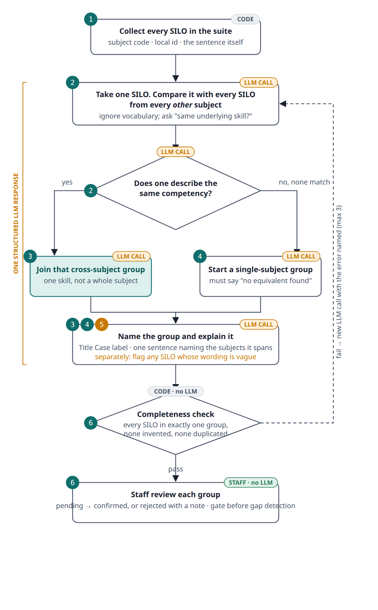{height=23cm}

*Figure 1: The instructions the model works under, in order. Grouping by subject is the one thing it must not do; a single-subject group is allowed only after every other subject has been checked. The dashed loop is the machine check that catches a dropped or doubled SILO. Numbered badges match the steps below. Amber LLM CALL marks a judgement made by the language model; steps 2 to 5 are produced in one structured response to a single prompt, not one call per SILO. The completeness check is plain code and the review is human.*

The worked example below uses the three-subject fixture in the repository (CSE1OOF, CSE2ALG, CSE3CAP: thirteen SILOs) and the model's actual output on it.

### Step 1. Start from the wording *(code)*

Thirteen SILOs across a first-year, a second-year and a capstone subject, read straight from the workbook. No model is involved yet. Two of them, from different subjects and different years:

| SILO | Wording |
|---|---|
| `CSE1OOF SILO2` | abstract data types and encapsulation to localise and minimise change |
| `CSE2ALG SILO4` | comparing algorithms and data structures and applying suitable choices to problems |

### Step 2. Compare across subjects, not within *(LLM decides)*

This is the language model's judgement, made from the wording alone under the instructions in Figure 1. The two sentences share almost no words. The question is whether a student who is weak at one would be weak at the other. Choosing an abstract data type and choosing a data structure for a problem are the same judgement at two points in the degree, so they match.

By contrast, the capstone's "reporting to technical and non-technical audiences" is communication, a different skill, so it is not pulled in even though it mentions technical work.

### Step 3. Name the group and justify it *(LLM decides)*

> **Data Structures and Algorithms**
>
> "Includes identifying, implementing, comparing, and evaluating data structures and algorithms (CSE1OOF SILO2 on abstract data types; CSE2ALG SILO2 to 5 on identifying, implementing, comparing and evaluating them)."
>
> Members: `CSE1OOF SILO2`, `CSE2ALG SILO1`, `CSE2ALG SILO2`, `CSE2ALG SILO3`, `CSE2ALG SILO4`, `CSE2ALG SILO5`

The label is a few words a coordinator would recognise. The rationale points at the SILO text and names the subjects spanned, so a reviewer can check it without re-reading the whole suite.

### Step 4. Single-subject groups are a last resort, and say so *(LLM decides)*

> **Technical Communication and Documentation**
>
> "No equivalent outcome found in the other subjects; includes reporting outcomes to diverse audiences and professional system documentation."
>
> Members: `CSE3CAP SILO3`, `CSE3CAP SILO4`

### Step 5. Flag vague wording, but still place it *(LLM decides)*

| SILO | Wording | Flag |
|---|---|---|
| `CSE2ALG SILO1` | overall objectives of Algorithms and Data Structures | does not name a specific skill |

The flag is feedback for the coordinator who wrote it, not a judgement on any student. The SILO still sits in the group above, because every SILO must land somewhere or a student's marks against it would silently vanish.

### Step 6. Check, then hand to staff *(code check, then staff decide)*

The completeness check is ordinary code, not a model: it confirms all 13 SILOs appear exactly once and none were invented. If the model dropped one, a fresh LLM call is made with the missing SILO named, up to three times in total.

The five resulting groups then sit as **pending** until staff mark each **confirmed** or **rejected** with a note. Gap detection will not run on a rejected group, and warns on pending ones. The dashboard carries the same warning on every page while any group used in the run is still pending.

---

## 3. How a student's marks become a priority group

Every assessment result carries a score, a weight, and the SILOs it assessed. Through the confirmed groups, each SILO points to one competency. A student's marks are pooled per competency into a single attainment figure, each figure is classified against both fixed cut-offs and the student's own profile, and the classifications decide the group.

**No language model is involved anywhere in this part.** Every step is arithmetic on the marks and the confirmed groups, so the same input always gives the same answer.

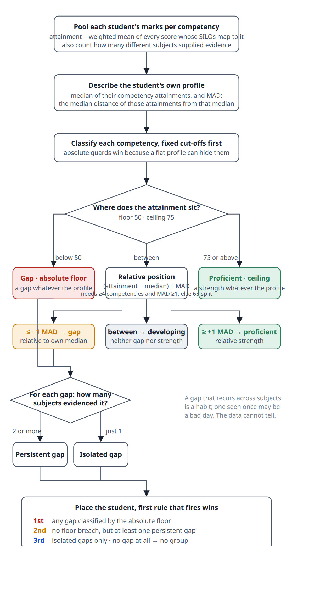{height=23cm}

*Figure 2: Deterministic code throughout, no LLM call. The order of the tests is deliberate. A student weak everywhere has a flat profile, so a relative test alone would call every competency "developing"; the 50% floor is checked first so that student still surfaces. The groups add no new threshold: they only combine labels already given.*

### 3.1 The steps

1. **Pool each student's marks per competency.** Attainment is the weighted mean of every score whose SILOs map to that competency. The number of different subjects that supplied evidence is counted at the same time.
2. **Describe the student's own profile.** Take the median of their competency attainments, and the MAD: the median distance of those attainments from that median.
3. **Classify each competency, fixed cut-offs first.** Below the 50% floor is a gap whatever the profile looks like. At or above the 75% ceiling is proficient whatever the profile looks like. The absolute guards go first because a flat profile can hide them.
4. **Otherwise, use the relative position:** (attainment − median) ÷ MAD. At or below −1 MAD is a gap relative to the student's own median; at or above +1 MAD is proficient; between is developing, neither gap nor strength. The relative test needs at least 4 competencies and a MAD of at least 1; with less profile than that, a plain 65% split is used instead and the basis says so.
5. **For each gap, count the subjects that evidenced it.** Two or more makes it a *persistent gap*; just one makes it an *isolated gap*. A gap that recurs across subjects is a habit; one seen once may be a bad day. The data cannot tell them apart, so the label carries the distinction.
6. **Place the student. The first rule that fires wins.**
   - **1st priority:** any gap classified by the absolute floor.
   - **2nd priority:** no floor breach, but at least one persistent gap.
   - **3rd priority:** isolated gaps only.
   - No gap at all: no group.

### 3.2 The numbers in play

| Rule | Value | What it does |
|---|---|---|
| Absolute floor | 50% | Below this a competency is a gap regardless of the profile. |
| Absolute ceiling | 75% | At or above this it is proficient regardless of the profile. |
| Relative gap cut-off | −1.0 MAD | At or below this many MADs under the median, a gap. |
| Relative strong cut-off | +1.0 MAD | At or above this, proficient. |
| Minimum competencies | 4 | Fewer than this and the profile is too thin to reason relatively. |
| Minimum spread | 1.0 | MAD under this is a flat profile; fall back to a plain 65% split. |
| Persistent needs | 2 subjects | A gap evidenced by two or more subjects is persistent. |

MAD is the median absolute deviation, unscaled. If a student's attainments are 62, 58, 66, 61 and 70, the median is 62, the distances from it are 0, 4, 4, 1 and 8, and the MAD is 4. A mark of 58 then sits at −1.0 MAD: on the line, and a gap.

**Why relative at all?** Two students can both score 58 in a competency. For one it is their usual level, for the other it is far below everything else they do. The second student has something specific to fix, and a fixed threshold cannot see that.

**The catch.** By construction roughly a quarter of every student's competencies fall below −1 MAD, so the relative rule alone flags almost everyone. On the 5,000-student run, 4,195 students had a persistent gap but only 1,145 of them had any mark under 50. The priority groups exist to separate those two cases.

---

## 4. One real student from each group

Each plot is that student's competency profile from the 100-subject, 5,000-student synthetic run. Every dot is one competency's attainment. The shaded band is the student's median ±1 MAD; the two dashed vertical rules are the fixed 50% floor and 75% ceiling. The filled coloured dot is the competency that decided the group: red for a gap by the floor, amber for a persistent gap found relatively, blue for an isolated gap found relatively. Hollow dots are competencies that are not gaps.

### 4.1 1st group: STU2009

At least one competency below the 50% floor. A gap whatever the rest of the profile looks like.

STU2009 · 12 competencies · median 62.0 · MAD 3.75

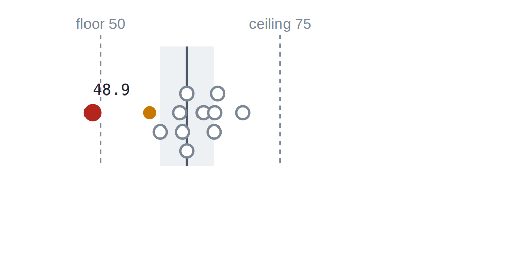{width=14cm}

**Why 1st.** *Applying analytical and computational methods* is 48.9%, pooled from 3 assessments in 2 subjects.

1. 48.9 is below the 50 floor, so it is a gap on the absolute rule before any profile arithmetic.
2. Two subjects evidenced it, so the gap is **persistent**.
3. A floor-based gap exists, so the student is in the 1st group. Their second gap (56.8, at −1.38 MAD, also persistent) does not change that.

### 4.2 2nd group: STU0794

No mark under the floor, but at least one persistent gap. Flagged only relative to the student's own median.

STU0794 · 10 competencies · median 83.8 · MAD 6.05

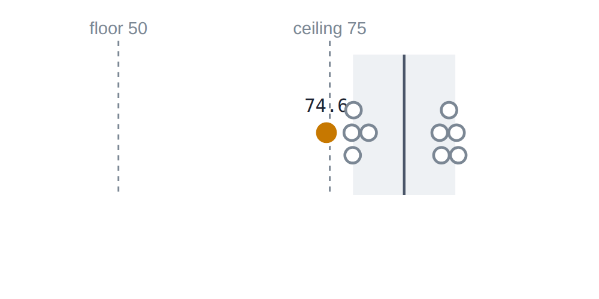{width=14cm}

**Why 2nd.** *Understanding biochemical processes* is 74.6%, pooled from 10 assessments in 3 subjects.

1. 74.6 is above the floor and just under the 75 ceiling, so the relative test applies: (74.6 − 83.8) ÷ 6.05 = **−1.53 MAD**, past the −1 cut-off. A gap.
2. Three subjects evidenced it, so it is **persistent**.
3. Nothing breached the floor, so this is the 2nd group. A strong student with one recurring soft spot: 74.6% would be a pass anywhere else on this page.

### 4.3 3rd group: STU0772

Isolated gaps only: every gap was evidenced by a single subject. Could be real, could be one bad assessment.

STU0772 · 11 competencies · median 83.0 · MAD 4.30

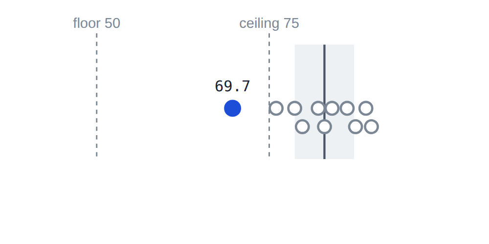{width=14cm}

**Why 3rd.** *Conducting laboratory experiments* is 69.7%, pooled from 3 assessments in 1 subject.

1. Above the floor, below the ceiling, so relative: (69.7 − 83.0) ÷ 4.30 = **−3.06 MAD**. A deep gap for this student.
2. Only one subject evidenced it, so it is **isolated**, however deep.
3. No floor breach and no persistent gap, so the 3rd group. The depth is why it still appears; the single source is why it ranks last.

### 4.4 The profiles behind the plots

| Student | Competency | Attainment | Classification |
|---|---|---|---|
| STU2009 | Applying analytical and computational methods | 48.9 | gap, absolute floor |
| STU2009 | Applying biological knowledge to environmental challenges | 56.8 | persistent gap, relative |
| STU2009 | Conducting laboratory experiments | 58.3 | |
| STU2009 | Analysing agricultural systems | 61.0 | |
| STU2009 | Applying microbiological techniques in diagnostics | 61.4 | |
| STU2009 | Understanding biochemical processes | 62.0 | |
| STU2009 | Applying mathematical models to real-world phenomena | 62.0 | |
| STU2009 | Adapting scientific communication | 64.3 | |
| STU2009 | Applying experimental methods to scientific investigation | 65.8 | |
| STU2009 | Formulating evidence-based arguments | 65.9 | |
| STU2009 | Critical analysis of literary texts | 66.3 | |
| STU2009 | Analyzing literary works and genres | 69.8 | |
| STU0794 | Understanding biochemical processes | 74.6 | persistent gap, relative |
| STU0794 | Applying biological knowledge to environmental challenges | 77.6 | |
| STU0794 | Conducting laboratory experiments | 77.7 | |
| STU0794 | Applying analytical and computational methods | 77.8 | |
| STU0794 | Applying experimental methods to scientific investigation | 79.6 | |
| STU0794 | Analysing agricultural systems | 88.0 | |
| STU0794 | Critical analysis of literary texts | 88.2 | |
| STU0794 | Adapting scientific communication | 89.1 | |
| STU0794 | Analyzing literary works and genres | 90.0 | |
| STU0794 | Formulating evidence-based arguments | 90.2 | |
| STU0772 | Conducting laboratory experiments | 69.7 | isolated gap, relative |
| STU0772 | Applying technical and business skills | 76.0 | |
| STU0772 | Applying biological knowledge to environmental challenges | 78.7 | |
| STU0772 | Analyzing literary works and genres | 79.8 | |
| STU0772 | Formulating evidence-based arguments | 82.1 | |
| STU0772 | Critical analysis of literary texts | 83.0 | |
| STU0772 | Applying analytical and computational methods | 84.1 | |
| STU0772 | Adapting scientific communication | 86.3 | |
| STU0772 | Understanding biochemical processes | 87.5 | |
| STU0772 | Analysing agricultural systems | 89.0 | |
| STU0772 | Applying experimental methods to scientific investigation | 89.8 | |

### 4.5 Progress along the sequence: a trajectory (IOLG-106)

The three students above are each a snapshot: one number per competency, and a verdict. The product also has to answer the question the project owner put first, "a gap in first year, consequence in third year": is a weakness recurring as the student moves through the degree, and where will it be assessed next? The object that answers it is a **trajectory**.

A trajectory takes one student and one competency, finds every subject whose outcomes belong to that competency, and lines them up in the order the degree intends them to be taken. For each subject the student has sat it carries their attainment there (the same per-subject figure as the gap card's evidence table); each subject they have not sat is placed where it will come, marked **ahead**. The trend compares the first and last subjects sat: more than a set number of points up is *improving*, more than that down is *declining*, anything inside the band is *stable*, and fewer than two subjects is *insufficient evidence*. The band is 5 points by default (§5.2) and, like the seven thresholds, is a proposal rather than a ratified value.

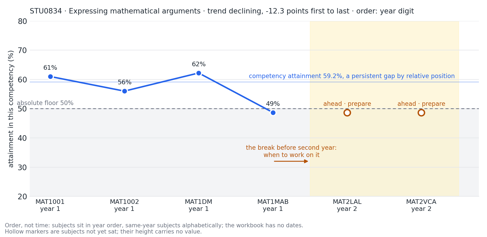{height=9cm}

*Figure 5b: STU0834's trajectory in Expressing mathematical arguments, from the 100-subject cohort. Four first-year maths subjects sat, 61% down to 49%, with the last below the floor; two second-year maths subjects ahead. Competency attainment 59.2% is a persistent gap by relative position. The dashboard shows the same thing as a row of chips on the gap card (§16).*

Three things to read off the figure, because they are the three things the chain on the gap card is for:

1. **The shape.** Four marks that drift down across first year are a different story from one bad mark, and the verdict (persistent gap, by relative position) is the same either way. The chain shows which story it is.
2. **Where it comes next.** MAT2LAL and MAT2VCA are ahead, and they assess this competency. That makes the break before second year the moment to work on it, with the learning plan and study strategy (§9) saying what and how. The dashboard labels those subjects "ahead · prepare".
3. **What it is not.** A forecast. Four marks are an ordering, not a slope, and the hollow markers have no value; their height on the chart is only where the eye lands. "Ahead" means the competency is assessed there, never that the student should or should not enrol: subject choice is an academic decision whose rules the system does not hold.

**Where the order comes from.** The intended sequence is declared in one setting, `LJA_SUBJECT_SEQUENCE` (§5.2); that is where the project owner's course map goes when one is supplied. A subject not in it is placed by the year digit in its code, and subjects in the same year have no order between them, so in the figure the four first-year subjects are alphabetical. Every trajectory states which rule placed it ("order: declared sequence", "year digit", "mixed" or "none"), in the same spirit as every gap stating its classification basis. The data carries no dates, so this is order, not time, and every page that shows a trajectory says so.

**A caveat on large cohorts.** Without a course map, "ahead" means every subject in the competency the student has no results in. On the three-subject workbook that is exact. On the 100-subject cohort a competency such as scientific communication spans fifteen subjects across seven degrees, so a biochemistry student's chain lists agriculture and engineering subjects they will never take, and a second-year student's chain can show a first-year subject they skipped as "ahead". The chain is still correct about where the competency is assessed; it is not yet filtered to the student's own degree. That filter is what the course map provides, and until it is supplied the chain should be read as "subjects that assess this", not "your next subjects".

---

---

# Part B. Producing the data

Everything the dashboard shows is computed from two inputs: a **results workbook** (or a Moodle database) and a **clustering cache** that holds the competency groups and the staff decisions about them. This part explains how to produce both, what each command's settings do, and which setting to reach for depending on what you want to find out. Every command is run from the `python/` directory with the `lja` conda environment active.

## 5. Before you start

### 5.1 Set up once

Follow the repository `README.md` Quick start. In short:

```bash
cd python
conda env create -f environment.yml
conda activate lja
cp .env.example .env        # then edit .env
```

The `.env` file holds the settings below. Nothing in it is needed to run the offline reference run in §5.3, so a first look at the dashboard needs no language model and no Moodle.

### 5.2 Settings in `.env`

| Setting | Default | When you need it |
|---|---|---|
| `LJA_LLM_PROVIDER` | `openai_compatible` | Which language model family to call. `openai_compatible` covers a local Ollama server; `anthropic` uses the Anthropic API. Needed for clustering, learning plans, study strategies and quizzes. Never used by the dashboard or the export. |
| `LJA_OPENAI_BASE_URL` | `http://localhost:11434/v1` | Where the local model answers (Ollama's default). |
| `LJA_OPENAI_MODEL` | `qwen3-vl:30b` | The local model's name. The reference run was produced with this model. |
| `LJA_OPENAI_TEMPERATURE` | `0.2` | Lower is more repeatable. Clustering has visible run-to-run variance even at 0.2, which is why the completeness check and retry exist (Part A, §2). |
| `LJA_OPENAI_MAX_TOKENS` | `16000` | Raise only if a large suite's clustering response is cut off. |
| `ANTHROPIC_API_KEY`, `LJA_ANTHROPIC_MODEL` | empty, `claude-opus-4-8` | Only with `LJA_LLM_PROVIDER=anthropic`. |
| `LJA_GAP_*` (seven values) | see Part A §3.2 | The classification thresholds. Set here to change them for every command at once; most also have a command-line flag. |
| `LJA_SUBJECT_SEQUENCE` **(IOLG-106)** | `CSE1OOF,CSE2ALG,CSE3CAP` | The order the degree intends the subjects to be taken, comma-separated. This is what "progress" and "trend" are measured along, and where a course map from the project owner goes. A subject not listed is placed by the digit in its code (`CSE2ALG` is year 2), and the student's page says when that happened. |
| `LJA_TREND_STABLE_BAND` **(IOLG-106)** | `5.0` | How many points a competency's attainment must move between the first and last subject before the trend is called improving or declining rather than stable. Shown on "This run". |
| `LJA_DASHBOARD_EXCEL_PATH`, `LJA_DASHBOARD_CLUSTERING_CACHE`, `LJA_DASHBOARD_PLANS_DIR` | the supplied workbook, `output/silo_clustering.json`, `output/plans` | What the dashboard opens when started with no flags (Part C, §13). |
| `LJA_DASHBOARD_QUIZZES_DIR`, `LJA_QUIZ_CATALOGUE` **(PR #52)** | `output/quizzes`, `../data-fixtures/subject_catalogue.yaml` | Where the dashboard looks for practice quizzes, and the catalogue the quiz command reads subject titles and handbook synopses from. |
| `LJA_EXPORT_SALT` | empty | Secret used to pseudonymise student ids in the research export. Keep it in `.env`, never in a command line. |
| `PGHOST`, `PGPORT`, `PGDATABASE`, `PGUSER`, `PGPASSWORD`, `LJA_MOODLE_TABLE_PREFIX` | `localhost`, `5432`, `moodle`, `lja_reader`, empty, `mdl_` | Only for `--source moodle`. The development Moodle uses prefix `m_`. |

### 5.3 The quickest first run

The repository ships a **reference run**: the supplied 150-student, 3-subject workbook, a clustering already produced by the model, and a review file with every group confirmed. It exists so the pipeline and dashboard work from a fresh clone with no model. From `python/`:

```bash
python -m lja.cli ../data-fixtures/CSE_results_150_students_3_Subjects.xlsx \
    --clustering-cache ../data-fixtures/reference-run/silo_clustering.json
LJA_DASHBOARD_CLUSTERING_CACHE=../data-fixtures/reference-run/silo_clustering.json \
LJA_DASHBOARD_PLANS_DIR=../data-fixtures/reference-run/plans \
    python -m lja.dashboard        # then open http://127.0.0.1:8000
```

The first command reproduces `data-fixtures/reference-run/gap_report.csv` exactly. The second serves it, with the three committed learning plans showing on the pages for STU0003, STU0004 and STU0022. Every screenshot in Part C was taken from this run.

> The reference run's groups were confirmed in bulk so that the pipeline runs. That is not a claim that staff reviewed them. The real Sprint 5 review is in `docs/cluster-review-sprint5.md`. Keep the reference review file all-confirmed: a rejected group makes the pipeline stop with exit code 2 and breaks every offline run built on it.

## 6. What the pipeline reads: the results workbook

The Excel path expects one workbook with three sheets. The supplied workbook and every generated cohort follow this shape, and the loader rejects anything else.

| Sheet | One row per | Columns |
|---|---|---|
| `Results` | student × assessment | `Student ID`, `Assessment Type` (prefixed with the subject code, for example `CSE1PE - Project stage 1`), `Score (1-100)`, `Feedback Comment`, `SILO's` (the outcomes this assessment evidenced, as `SILO1: text; SILO3: text`), `Weight`, `Weighted Score` |
| `Student Summary` | student | `Student ID`, `Program`, one `<SUBJECT> Total` column per subject (blank where not enrolled), `Average Total`, `Performance Band` |
| `Assessment Map` | assessment | `Subject Code`, `Assessment Type`, `Weight`, `Contribution` (Individual or Group), `Early Assessment`, `Hurdle`, `SILOs` (which of the subject's outcomes it assesses), `SILO Theme Summary` (the outcome wording) |

Two facts about this shape drive everything downstream:

- **A mark counts towards every SILO its assessment lists.** An assignment mapped to SILO2, SILO3 and SILO4 puts the same score into three outcomes, and from there into whichever competencies those outcomes belong to. The dashboard's "This run" page calls this the flagged approximation, and the SMD documents it.
- **Nothing carries a date.** "Progress across subjects" on the student page is ordered by the intended subject sequence (`LJA_SUBJECT_SEQUENCE`, §5.2), falling back to the year level in the subject code, not by time. **(IOLG-106)**

## 7. Running the pipeline: `python -m lja.cli`

This is the command that turns a workbook into competency groups and a gap report. It does three things in order: cluster the SILOs (calling the model, or reading the cache), apply the staff-review gate, and classify every student × competency pair.

```bash
python -m lja.cli <workbook.xlsx> [options]
```

### 7.1 What comes out

| File | Contents |
|---|---|
| `output/silo_clustering.json` (or the `--clustering-cache` you named) | The competency groups: label, rationale, member SILOs, flagged SILOs. Written only when the model was called. |
| `<cache>.review.json` beside it | One record per group with its state (`pending`, `confirmed`, `rejected`) and note. Created if missing, with every group pending. |
| `output/clusters.csv` | The clustering as one row per SILO, then a second section with every SILO's text. |
| `output/gap_report.csv` | One row per student × competency: `student_id`, `competency_label`, `attainment_pct`, `subjects_evidencing`, `n_observations`, `classification`, `classification_basis`, `relative_position`. This is the table the dashboard recomputes and shows. |
| Console | The groups, the flagged SILOs and the SILO definitions, as tables. |

### 7.2 Options

| Option | Default | Meaning |
|---|---|---|
| `--source excel` or `moodle` | `excel` | Where the data comes from. See §12 for Moodle. |
| `--clustering-cache PATH` | `output/silo_clustering.json` | Where the groups are read from and written to. Point it at a fixture to avoid calling the model. |
| `--review-file PATH` | `<cache>.review.json` | Staff decisions. Normally leave the default so the file stays beside its cache. |
| `--refresh-clustering` | off | Ignore the cache and ask the model again. Needed whenever you change `--extra-instructions` or the model settings. |
| `--extra-instructions TEXT` | none | Appended to the clustering prompt verbatim, for experiments. Silently ignored unless you also pass `--refresh-clustering`. |
| `--allow-unconfirmed` | off | Let the gap report be produced while groups are still pending. Rejected groups always stop the run. |
| `--absolute-floor`, `--absolute-ceiling`, `--relative-gap-cutoff`, `--relative-strong-cutoff`, `--min-competencies`, `--min-spread` | 50, 75, −1, +1, 4, 1.0 | The classification thresholds from Part A §3.2. The seventh, the 65% fallback split, has no flag and is set only by `LJA_GAP_FALLBACK_PROFICIENT`. |
| `--gaps-out`, `--clusters-out` | `output/gap_report.csv`, `output/clusters.csv` | Where to write the two CSVs. |
| `--mapping PATH` | `../data-fixtures/criterion_silo_map_CSE1IOI.csv` | Rubric-criterion to SILO map, Moodle source only. |

**Exit codes.** `0` success. `2` when any group is rejected, or when groups are pending and `--allow-unconfirmed` was not given. If a cached clustering does not cover every SILO in the workbook (for example after adding a subject), the model is called again automatically.

### 7.3 Which settings for which question

| You want to know | Do this |
|---|---|
| What the product says about this cohort, as configured | Run with defaults against a confirmed clustering. Read `gap_report.csv` or open the dashboard. |
| How sensitive the flags are to the floor | Re-run with `--absolute-floor 45` and again with `55`, keeping the same cache. The "This run" page marks changed values. Compare the 1st-priority counts. Do not change the cache between runs. |
| Whether the model groups the outcomes differently on another attempt | `--refresh-clustering` into a **different** `--clustering-cache` path, then `python -m lja.review --clustering-cache <new>` to compare. Never refresh over a cache that carries staff decisions. |
| Whether a prompt change helps | `--refresh-clustering --extra-instructions "..."` into a new cache, as above. |
| Why almost everyone is flagged | Nothing to change: that is the relative rule (Part A §3.2, "the catch"). Look at the priority groups instead of the persistent-gap count. |
| Whether the method finds gaps you know are there | Use a synthetic cohort with planted gaps and `catalogue_verify` (§11). |

## 8. Confirming the competency groups: `python -m lja.review`

Every group the model proposes starts **pending**. Staff move it to **confirmed** or **rejected**; a rejection needs a note saying what is wrong. Settled decisions cannot flip directly: a group goes back to pending first, so a re-review is visible in the file.

```bash
python -m lja.review                                    # list every group with id, label, members, state
python -m lja.review --cluster 3f2a --state confirmed   # id prefix is enough if unique
python -m lja.review --cluster 9c1e --state rejected --note "Mixes written and oral communication"
```

With no `--cluster` on a terminal it prompts for id, state and note. `--clustering-cache` defaults to `output/silo_clustering.json`, so point it at the cache you are reviewing.

**What a decision does.** A rejected group blocks the pipeline (`lja.cli` exits 2) and prints rework instructions. A pending group lets the pipeline run only with `--allow-unconfirmed`, and the dashboard then carries a red **AI review warning** on every page with the pending and rejected counts. Confirmed groups are silent.

**Reviewing well.** Read the rationale against the member SILOs' wording, not against the label. Reject when members are the same skill in name only (the prompt's own counter-example is written reporting versus oral presentation), or when a group is one whole subject rather than one skill. Single-subject groups are legitimate when the rationale says no equivalent was found elsewhere. A flagged vague SILO is feedback for its coordinator, not a reason to reject the group it sits in.

**The Sprint 5 review, as done.** Sui Lung reviewed the five reference-run groups on 26 September (`docs/cluster-review-sprint5.md`, landed 2 October under IOLG-133): four Agree, one Disagree (Object-Oriented Design and Implementation), and both SILOs the model flagged as vague were agreed vague. The verdicts are kept in a separate file, `data-fixtures/reference-run/silo_clustering.review.sui-lung.json`, so the all-confirmed reference run keeps working offline. That is the pattern to follow: a reviewer's decisions go in a review file of their own, named for them, and the pipeline is pointed at it with `--review-file` when their verdicts should drive a run. ⚠ *TO FILL: who signs off a review before it drives a report for staff, and whether the project owner confirms or overrules at the 4/5 October review.*

## 9. Learning plans, study strategies and practice quizzes

All three commands call the language model for one student and check every reference in the answer against the data before writing anything. They need a confirmed clustering; pass the cache and review file explicitly when they are not in the default place. The quiz command is in open pull request #52 **(PR #52)**.

```bash
R=../data-fixtures/reference-run
python -m lja.plan     <workbook.xlsx> STU0003 --clustering-cache $R/silo_clustering.json --review-file $R/silo_clustering.review.json
python -m lja.strategy <workbook.xlsx> STU0003 --clustering-cache $R/silo_clustering.json --review-file $R/silo_clustering.review.json
python -m lja.quiz     <workbook.xlsx> STU0003 --clustering-cache $R/silo_clustering.json --review-file $R/silo_clustering.review.json   # PR #52
```

| Command | Writes | What it contains |
|---|---|---|
| `lja.plan` | `output/plans/learning_plan_<id>.json` and `.md` | Priorities in order, each with the competency, actions to do, the evidence (subjects and marks) it rests on, and the assessments to revisit; plus strengths to build on. The dashboard shows this file under "Recommended next actions". |
| `lja.strategy` | `output/strategies/study_strategy_<id>.json` and `.md` | One entry per gap competency. A persistent gap must name two or more subjects and include interleaving or spaced practice; an isolated gap gets subject-specific tactics. |
| `lja.quiz` **(PR #52)** | `output/quizzes/quiz_<id>.json` and `.md` | Two questions per gap competency by default (`--items-per-gap`), each tied to one of the student's SILOs and one of their assessments, with the subject's handbook synopsis as background. A question is either multiple choice (3 or 4 options and a key) or a written task (a model answer and 2 to 5 marking points). Then a second, blind pass by the model answers each question without seeing the key and writes the explanation a tutor would give; the code compares and marks any disagreement. The dashboard shows the quiz on the student's page. |

Shared options: `--out-dir`, `--max-attempts` (default 3, how many times to regenerate a plan that names something not in the data), `--extra-instructions`, `--source` and `--mapping`.

**Quiz options (PR #52).** `--format` is the educator's policy: `multiple_choice`, `written`, or `mixed` (the default), under which the model chooses per question but an outcome whose wording asks the student to *do* something (implement, design, analyse, explain, …) must get a written task. Written tasks are the better learning instrument where the outcome asks for doing; multiple choice is the only kind that marks itself. `--catalogue` names the subject catalogue for titles and synopses (skipped if the file is missing; the quiz then shows codes only). `--skip-educator-review` leaves out the blind second pass.

**Exit codes.** `0` written, or for `strategy` and `quiz`, the student has no gap so nothing was generated. `1` the model could not produce a grounded answer in the allowed attempts; nothing is written. `2` bad input, or the student's competencies include a rejected group. A pending group gives a warning but proceeds.

> All three are AI-generated documents. The grounding check proves every competency, subject and assessment named exists and belongs to that student. It does not prove the advice is good, and for a quiz it cannot prove the marked answer is correct: the only subject matter the model is given is the outcome wording, the assessment names, the marker's feedback and the handbook synopsis, so the question and its answer come from the model's general knowledge. The blind second pass catches a disagreement, not a shared blind spot (on the first live run the same model agreed confidently with a question a tutor could mark the other way). Nothing here is student-facing until staff have read it; the dashboard says so above every plan and every quiz.

## 10. Exporting for research: `python -m lja.export`

Writes the whole run as flat CSVs for longitudinal and A/B evaluation. Never calls the model.

```bash
python -m lja.export <workbook.xlsx> --clustering-cache <cache> --out output/export --anonymise
```

| Output | Rows |
|---|---|
| `students.csv` | one per student: performance band, average total, then one column per subject with the student's total (blank where not enrolled) |
| `competencies.csv` | one per student × competency: the gap report's columns (attainment, classification, basis, relative position, subjects evidencing, observations) plus the trend across subjects and `in_plan`, which is true when the student's learning plan (read from `--plans-dir`) names this competency as a priority |
| `cohort.csv` | one per competency, aggregated over the cohort: gap rate and proficient rate, with no student ids |
| `manifest.json` | source, git commit, cache path, every threshold value, schema version |

`--anonymise` replaces each student id with a 12-character pseudonym derived from `LJA_EXPORT_SALT`. The same salt gives the same pseudonym across runs, so two exports can be joined; a different or empty salt cannot be reversed to the id. Column definitions are in `docs/export-schema.md`.

## 11. Making a synthetic cohort

Two generators exist. Use the **catalogue generator** for anything beyond the supplied three subjects; it is the one that gives students a hidden ability per competency, which is what the product is supposed to detect.

### 11.1 `python -m lja.data.catalogue_generator`

```bash
python -m lja.data.catalogue_generator ../data-fixtures/subject_catalogue.yaml \
    --students 500 --seed 42 --out ../data-fixtures/CSE_results_catalogue_500_synthetic.xlsx
```

It writes the workbook and, beside it, three truth files: `<stem>.truth.json` (every student's hidden abilities, which students carry a planted gap and where), `<stem>.clustering.json` (the catalogue's own competency grouping in the cache format) and `<stem>.clustering.review.json` (all confirmed). Run the pipeline with `--clustering-cache <stem>.clustering.json` and the dashboard's "This run" page will show the generator's seed and parameters, never the answer key.

| Setting | Default | What it changes in what you see |
|---|---|---|
| `--students` | 300 | Cohort size. 5,000 takes about 25 seconds to generate and 20 to classify. |
| `--seed` | 42 | Same seed, same cohort. Change it for an independent draw. |
| `--baseline-mean`, `--baseline-sd` | 68, 11 | The population spread of student ability, matched to the supplied workbook. Raising the SD puts more students under the 50% floor. |
| `--competency-sd` | 7 | How much a student's ability varies from competency to competency. **0 reproduces the supplied data's flat profiles**, where the relative rule cannot see anything. Higher values give deeper natural dips, which are harder to tell from planted gaps. |
| `--noise-sd` | 4 | Per-assessment marking noise: a bad day. |
| `--planted-gap-fraction` | 0.08 | Share of students given one deliberately suppressed cross-subject competency. |
| `--planted-gap-depth` | `18,30` | How many points the planted competency is pushed down, drawn uniformly between the two. |
| `--planted-gap-competencies` | all cross-subject | Restrict planting to named competency ids. |
| `--enrolment-fraction` | 1.0 | Probability a student takes each subject; below 1.0, programs' rules still apply. |
| `--latent-share`, `--program-selection` | 0.7, 0.6 | How much of ability comes through shared aptitude traits, and how strongly a program's students lean to the traits its core subjects reward. These make strengths correlate the way a real degree's do. |
| `--no-llm-feedback` | off | Use the built-in feedback templates instead of asking the model for varied wording. |
| `--moodle-out DIR`, `--moodle-students N`, `--llm-remarks` | none | Also write the Moodle seeding fixtures for the development instance. |

**Checking recall.** After the pipeline runs on a generated cohort:

```bash
python -m lja.data.catalogue_verify <stem>.truth.json --gaps output/gap_report.csv
```

This scores the gap report against the planted gaps. Read the result with care: on the 5,000-student run the method finds nearly every planted dip, but ordering students by severity does not separate planted gaps from natural weak spots, because `--competency-sd 7` makes natural dips as deep as the planted ones. That finding is recorded on IOLG-134 and feeds action A-01.

### 11.2 `python -m lja.data.synth_generator`

Adds students to an existing workbook, keeping its subjects. Students get one baseline plus noise, so their profiles are flat and the relative rule rarely fires. Useful for load testing the supplied three subjects, not for testing gap detection.

```bash
python -m lja.data.synth_generator ../data-fixtures/CSE_results_150_students_3_Subjects.xlsx --add 150 --out ../data-fixtures/CSE_results_300_students_3_Subjects_synthetic.xlsx
```

Options: `--add`, `--seed`, `--planted-gap-fraction`, `--planted-gap-silos` (SUBJECT:SILOn keys to suppress), `--no-llm-feedback`.

### 11.3 The 100-subject cohort

The large test cohort (100 real La Trobe subjects, 448 handbook SILOs, 5,000 students) is not in git. `data-fixtures/README-handbook-cohort.md` explains why it was built from the public handbook and gives the commands to rebuild it in about ten minutes. Part A's three example students come from it.

## 12. Reading from Moodle instead of a workbook

Every pipeline command accepts `--source moodle`. The loader reads rubric fillings straight from the Moodle database with a read-only role, using the criterion-to-SILO map given by `--mapping`, and builds the same in-memory dataset the workbook path builds. The Moodle web-services API has no function for rubric fills, which is why the database route exists (risk register row 1).

```bash
python -m lja.cli --source moodle --mapping ../data-fixtures/criterion_silo_map_CSE1IOI.csv
```

Connection settings are the `PG*` variables in §5.2. The development instance from `devenv/bootstrap.sh` and `devenv/seed.sh` uses prefix `m_` and answers on port 8081; its credentials are in `devenv/env.sh` and must never be reused elsewhere. The security evidence for the read-only role is in `docs/security-evidence.md`.

The six security checks (role created, update refused, fixture readable, database unchanged by a run, web-service token scope, scanner results) were all observed on the development instance on 28 September; none has been run on a shared instance yet.

**The dashboard reads Excel only.** `python -m lja.dashboard` has `--excel-path` and no `--source` option, and there is no command that writes a Moodle run back out as a workbook. So a Moodle-sourced run can be analysed (`lja.cli`, `lja.plan`, `lja.export` all take `--source moodle`) but not yet browsed. ⚠ *TO FILL: production connection procedure (who provisions `lja_reader`, which host, how the criterion map is maintained per subject), once the shared-instance step in IOLG-111 is done.*

---

# Part C. Using the dashboard

The dashboard is a read-only view over one run. It never calls the language model and never writes anything. It recomputes the classification from the workbook and the clustering cache when it starts, so what it shows is always consistent with the files named on its "This run" page, not with whatever `gap_report.csv` a different command produced.

Everything in this part is on `main` except the practice quiz section of the student page, which is in open pull request #52 and marked **(PR #52)**.

## 13. Starting it and finding your way

```bash
python -m lja.dashboard --excel-path <workbook.xlsx> --clustering-cache <cache.json> [--port 8000] [--host 127.0.0.1]
```

With no flags it opens the workbook and cache named in `.env` (`LJA_DASHBOARD_EXCEL_PATH`, `LJA_DASHBOARD_CLUSTERING_CACHE`). The review file is always `<cache>.review.json` beside the cache; if it is missing every group counts as pending and the warning banner shows. Learning plans are read from `LJA_DASHBOARD_PLANS_DIR` (default `output/plans`) and, with PR #52, practice quizzes from `LJA_DASHBOARD_QUIZZES_DIR` (default `output/quizzes`). Only `--absolute-floor` and `--absolute-ceiling` can be changed on this command line; the other thresholds come from the `LJA_GAP_*` variables. The charts load Chart.js from a public CDN, so the browser needs internet access even though the data never leaves the machine.

**The header, on every page.** The title carries the tag "gap report · read-only · dev mode, no sign-in": there is no login yet, so run it on a machine you control. The navigation is **Students**, **Outcome quality**, **Provenance** and **Glossary**, and a **Student** picker on the right jumps straight to one student's page.

**The AI review warning.** When any group in the run is pending or rejected, a red banner at the top of every page states how many of each. It disappears only when staff have confirmed every group (§8).

**Controls you will meet everywhere:**

- **Every count is a link.** A tile that says "13 SILOs" opens the list of those 13. A statistic tile opens the glossary entry that defines it.
- **Enlarge** on any chart opens it full screen with hover tooltips and a live readout of the pointer position. Esc or Close returns. Clicking a point opens the same page as in the small chart.
- **Scroll boxes.** Any table that can outgrow a screen sits in a bounded box with a sticky header and a row count. Its toolbar has a **filter field** that hides rows as you type unless some cell contains the text, showing "N of M match", and an **Expand** button that opens the box full screen.
- **Sortable headings.** Click a column heading to sort by it; click again to reverse.
- **`?` links** beside a term open its glossary entry.
- **Badges** carry the classification: red persistent gap, amber isolated gap, blue developing, green proficient. The chart colours never disagree with the badges.

## 14. The Students page (`/`)

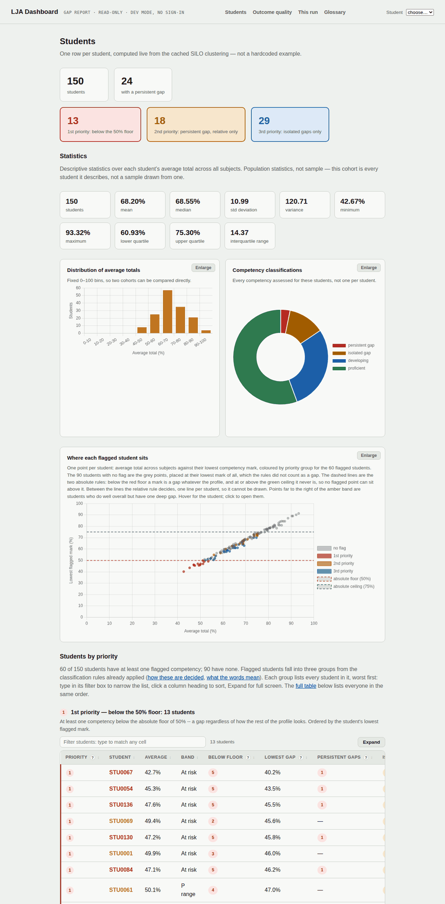{height=22cm}

*Figure 6: The Students page. Tiles, then statistics, then charts, then the priority groups and the full table. Reference run, 150 students.*

This is the triage page. Read it top to bottom.

1. **Cohort tiles.** "150 students" and "24 with a persistent gap" open the matching cohort pages. Below them the three priority tiles in red, amber and blue: 1st priority below the 50% floor, 2nd priority persistent gap relative only, 3rd priority isolated gaps only. Their definitions are Part A §3. The counts, plus the unflagged remainder, sum to the cohort.
2. **Statistics.** Mean, median, standard deviation, variance, minimum, maximum, quartiles and interquartile range of each student's average total. These are population statistics, because the cohort is the whole group being described.
3. **Distribution of average totals.** A histogram on fixed 0 to 100 bins of width 10, so two cohorts viewed one after another have the same axis and can be compared by eye.
4. **Competency classifications.** The share of every student × competency pair in each of the four classes.
5. **Where each flagged student sits.** One point per student: average total against their lowest competency mark, coloured by priority group, unflagged students in grey. The two dashed lines are the floor and ceiling. A point far below the diagonal is a strong student with one deep gap. Hover for the student, click to open them.
6. **Students by priority.** Each group has its definition, its ten most severe students (lowest flagged mark first) and a link to the full cohort page.
7. **All students.** Every student, sortable, in a scroll box. Columns: student, average, band, **Priority**, **Below floor** (the lowest mark that breached it), **Lowest gap** (mark and its position in MAD), persistent gaps, isolated gaps, strengths. Default order is priority, then lowest flagged mark.

**What to do with it.** Start with the 1st-priority list; those students have a mark under the floor in a competency and the case needs no statistics to make. The 2nd group is where the relative rule earns its keep: students doing well overall with one recurring soft spot. The 3rd group is for a subject coordinator rather than a course coordinator, since each flag comes from one subject.

## 15. Cohort pages (`/cohort/<key>`)

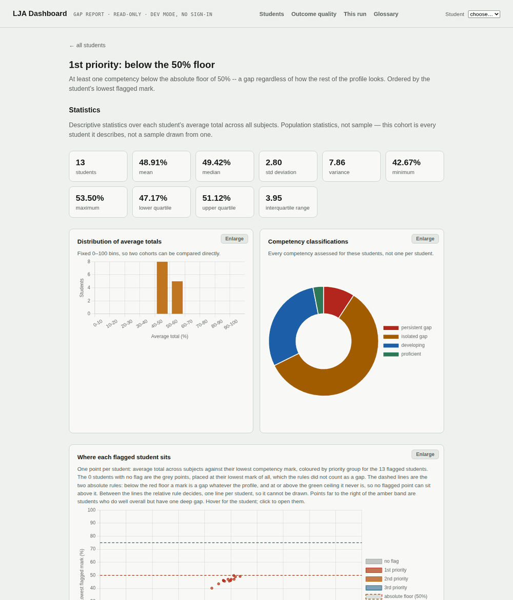{height=16cm}

*Figure 7: A cohort page restricted to the 13 first-priority students of the reference run.*

The same body as the Students page, restricted to one cohort: `all`, `persistent-gap`, `priority-1`, `priority-2` or `priority-3`. The page opens by stating the rule that put its students there, with the live threshold values, so a screenshot of it is self-explaining. There is deliberately no "at risk" cohort: the institution has no definition to match, and inventing one is the team's decision under action A-01, not a dashboard default.

## 16. A student's page (`/student/<id>`)

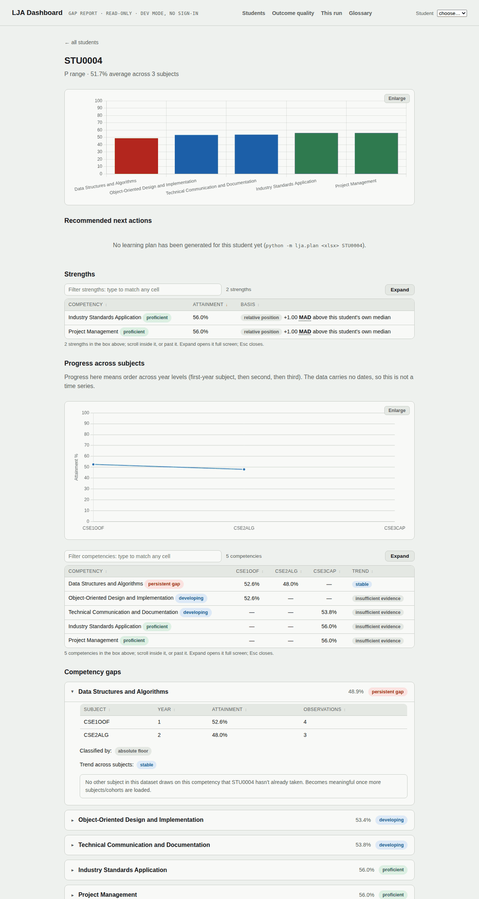{height=22cm}

*Figure 8: STU0004, a first-priority student in the reference run: one competency below the floor, evidenced by two subjects.*

The header gives the id, the performance band, and the average across the subjects taken. Then, in order:

- **Attainment by competency.** One bar per competency, coloured by classification.
- **Recommended next actions.** The learning plan from `lja.plan` (§9) if one exists: a summary, then one card per priority with what to do, the evidence it rests on, and the assessments to revisit, plus strengths to build on. The page states that the plan was generated by a language model and checked for references, not for quality. Without a plan it prints the command that would make one.
- **Strengths.** Every proficient competency, strongest first, each with its basis: how many MAD above the student's own median, or that it passed the fixed ceiling.
- **Progress across subjects.** A line per competency across the subjects in sequence order, for competencies evidenced in two or more subjects, and a table with a trend word (stable, improving, declining, or insufficient evidence). Sequence order, not time order: the data carries no dates. The trend compares the first and last subject sat; a move inside the stable band (5 points by default, §5.2) is "stable". **(IOLG-106)**
- **Practice quiz (PR #52).** If `lja.quiz` has written one for this student (§9): an introduction, the subjects involved with their handbook synopses, then one question per card grouped by gap competency, each labelled with the outcome and assessment it practises. A multiple-choice question has a "Show answer" control; a written task has "Show model answer", which reveals the model answer and the marking points. Under each question a collapsed block, "For educator view only", holds the blind second pass: whether it agreed with the key (or, for a written task, whether the model answer meets its own marking points), its confidence, the explanation a tutor would give, and any concern it raised. A summary line names any question where the two passes disagreed; that is the one to check first. The page states that the answers have not been verified against course material and asks for staff review before a student uses the quiz. "For educator view only" is a label, not a login: anyone who can open the page can expand it.
- **Competency gaps.** A card per competency, worst first. Open one to see the per-subject evidence (subject, year, attainment, number of observations), the basis of the classification (absolute floor, relative position with the MAD value, or insufficient data), the trend with its first-to-last change in points, and then the **subject chain (IOLG-106)**: every subject whose outcomes belong to this competency, in the intended order. A subject the student has sat is a plain chip with their attainment there; a subject still ahead is an amber dashed chip marked "ahead · prepare". An "order:" note says which rule placed them: *declared sequence* when the subjects are in `LJA_SUBJECT_SEQUENCE`, *year digit* when they were placed by the digit in their code, *mixed*, or *none* when nothing could be ordered. Under the chain, for a gap, the "flag for intervention" sentence lists the subjects ahead in order, so the first named is where the student meets this competency next. That is what turns a flag into something to act on before the next assessment rather than after it.

**Reading a card.** "Classified by: absolute floor" means the mark alone decided it. "Classified by: relative position, −1.53 MAD" means the mark was acceptable in isolation but well below this student's own median. Part A §4 walks three real cards.

**Reading the chain.** "CSE1OOF 62.7% → CSE2ALG 64.1% → CSE3CAP ahead · prepare" says the weakness showed in both first- and second-year subjects and will be assessed again in the capstone; the break before CSE3CAP is the time to work on it, with the learning plan and study strategy above. Part A §4.5 draws one as a chart and explains what to read off it. The chain is an ordering, not a forecast: two or three marks do not make a slope, and "ahead" is where the competency comes up next, never a subject to avoid or a reason to change enrolment. On the reference run every student has sat all three subjects, so no chip is marked ahead; the marker appears on the larger synthetic cohorts and on any real cohort part-way through a degree.

## 17. Outcome quality (`/silos`) and the outcome lists

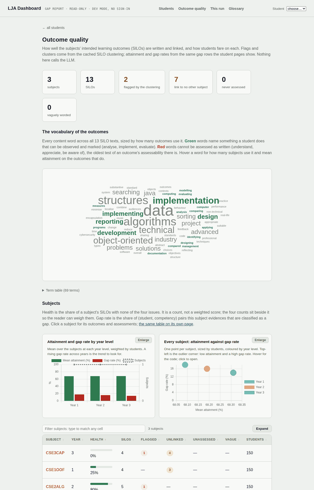{height=20cm}

*Figure 9: Outcome quality. The tiles count issues; each opens the list of SILOs it counts.*

This page is about the learning outcomes themselves, not about students. It answers the question a curriculum committee asks: are the outcomes written so that a student's work can be evidence of them?

- **Tiles.** Subjects, SILOs, and four issue counts: **flagged** (the model declined to place the outcome and said why), **link to no other subject** (its competency contains outcomes from this one subject only, so work here is evidence about nothing else), **never assessed** (no assessment in the subject's map evidences it, so no student can have a mark against it), **vaguely worded** (a verb that cannot be assessed as written: understand, appreciate, be aware of). A subject's **health** is the share of its SILOs with none of these.
- **The vocabulary of the outcomes.** The verbs and nouns the suite uses, as a cloud and a table.
- **Subjects**, with health and gap rate, linking to each subject's page.
- **Progression by competency**, linking to each competency's page.
- **Which subjects share competencies.** A chord diagram at subject level for small suites, discipline level for large ones.
- **Attainment by subject and competency.** The matrix.
- **Every outcome**, issues first, with links to the filtered lists.

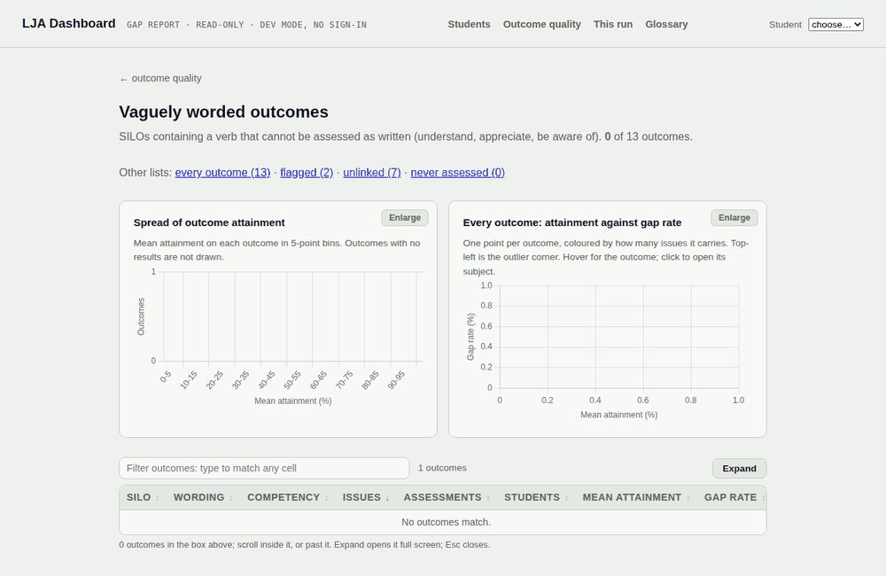{height=11cm}

*Figure 10: One of the five outcome lists. The sentence under the title states the filter; the charts are drawn from exactly the rows in the table.*

Each list (`/silos/list/all`, `flagged`, `orphan`, `unassessed`, `vague`) opens with the filter stated in a sentence, links to the other lists with their counts, a histogram of mean attainment and a scatter of attainment against gap rate, then the SILO table in a scroll box.

**What to do with it.** Send the vague list to the subject coordinators who wrote those outcomes: it is feedback on wording, not on students. Never-assessed outcomes are a mapping problem in the Assessment Map sheet. Orphan outcomes are not wrong, but nothing across the degree corroborates them.

## 18. Competencies (`/competencies`) and a competency's page

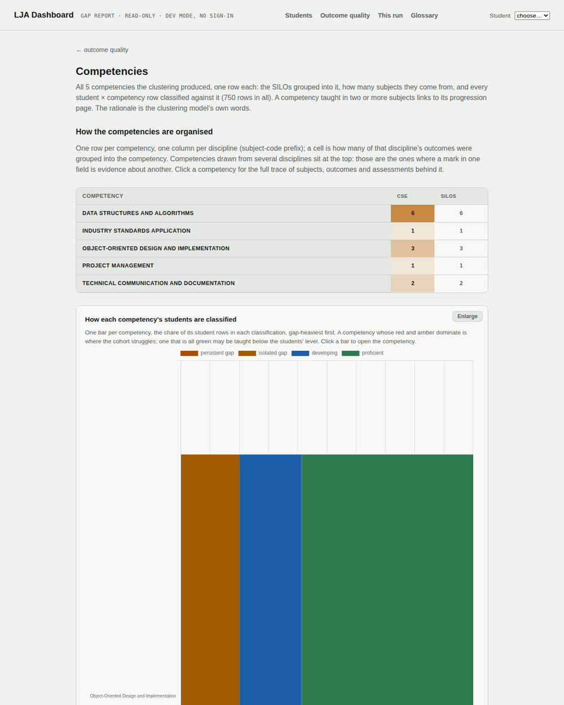{height=17cm}

*Figure 11: The Competencies page: every group, how it spreads across disciplines, and how each group's students are classified.*

The Competencies page lists every group with its label, member SILOs (each linking to its subject), subject count, the model's rationale, and the classification counts. Above the table, a competency × discipline map shows where each group's outcomes come from, multi-discipline groups first, and a stacked bar shows the classification shares per group, gap-heaviest first.

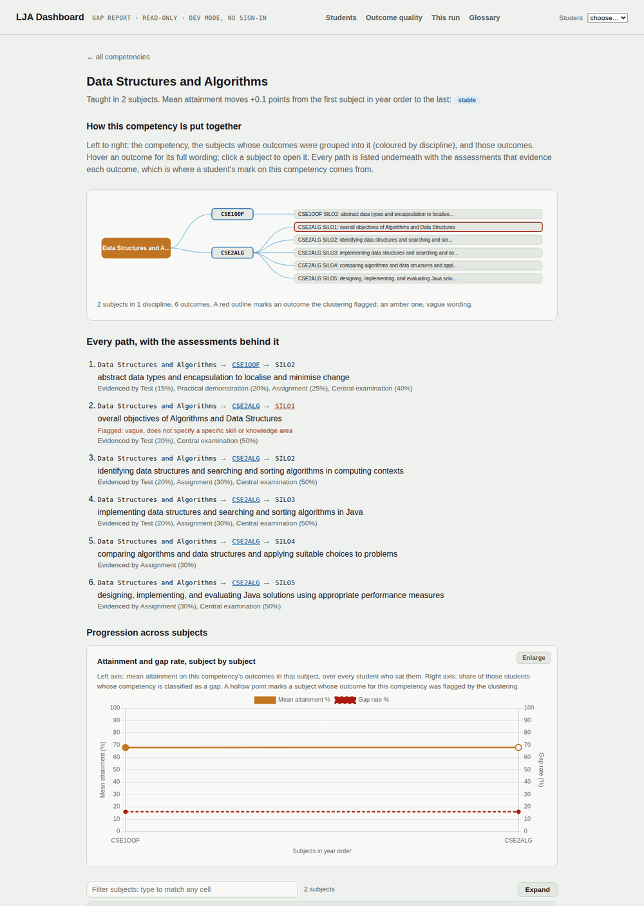{height=20cm}

*Figure 12: Data Structures and Algorithms in the reference run: the trace from competency to subjects to outcomes to assessments, then progression across the subjects that teach it.*

A competency's page opens with its trace: the competency, the subjects whose outcomes were grouped into it, those outcomes (hover for the wording; a red outline means the model flagged it, amber means vague wording), and under it every path listed with the assessments that evidence each outcome. That chain, from a student's mark to their classification, is the answer to "why does the dashboard say this?". Below it, for a competency taught in two or more subjects, attainment and gap rate by subject with a trend badge, and the model's own explanation of why these outcomes were grouped.

## 19. Subjects, a subject, and assessments

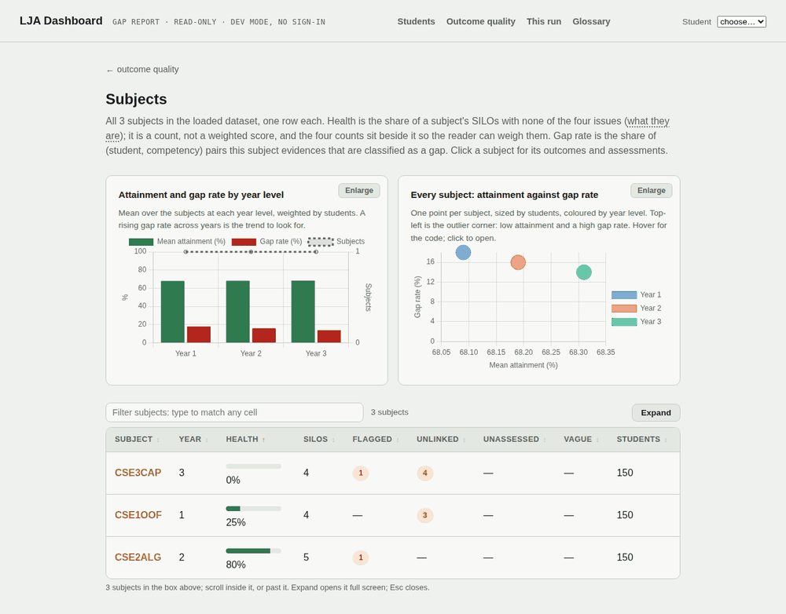{height=12cm}

*Figure 13: Subjects, with year level, SILO count, health, mean attainment and gap rate.*

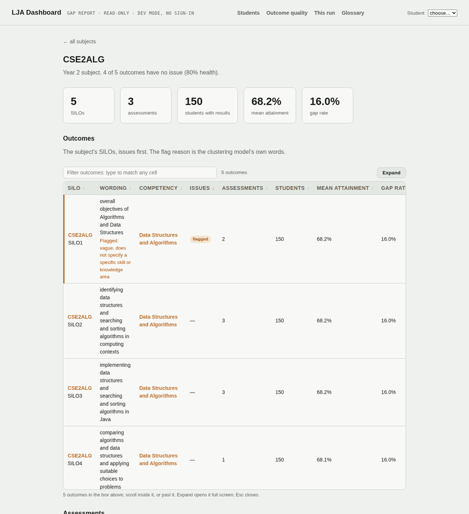{height=15cm}

*Figure 14: CSE2ALG: its outcomes with any issues first, and its assessments.*

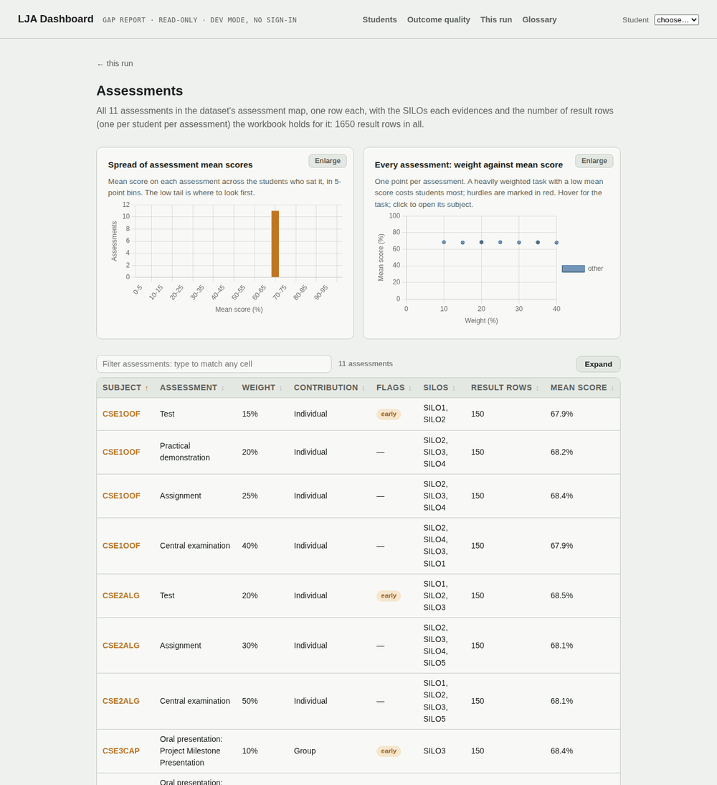{height=15cm}

*Figure 15: Every assessment with weight, mean score, hurdle and the outcomes it evidences.*

These three pages are the inputs seen from the curriculum side. **Subjects** ranks every subject with its health and gap rate and summarises by year level. A **subject's page** shows its outcomes (issues first, with the flag reason) and its assessments, and counts the students with results in it. **Assessments** lists every assessment with its subject, mean score, weight, contribution type, hurdle and early-assessment flags, the SILOs it evidences and the result count, with charts of the spread of mean scores and of weight against mean score (hurdles in red). Unmapped result rows are reported at the bottom.

**What to do with it.** A high-weight assessment with a low mean and many SILOs attached moves a lot of students' classifications at once; that is where to look first when a competency's gap rate looks wrong.

## 20. Provenance (`/run`)

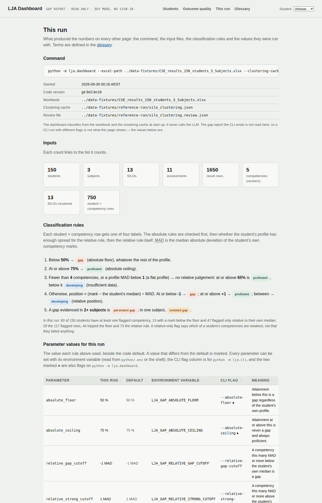{height=22cm}

*Figure 16: Provenance (titled "This run" when the screenshot was taken; renamed in PR #54): the command, the files, the input counts, the rules and the parameter values that produced every other page.*

Open this page before quoting any number from the dashboard. It opens with the pipeline command that reproduces its numbers as files, `python -m lja.cli` with the same workbook, cache, review file and any changed threshold (PR #54). Then it shows the exact command that started the dashboard, when, the git version, the workbook, cache and review file; linked input counts; the classification rules as an ordered list with this run's values; a table with one row per threshold giving the value used, the code default, the environment variable, the CLI flag, and a mark on anything that differs from the default; a histogram of where the flagged marks sit; and, for a synthetic cohort, the generator's seed and parameters. A further table, **Subject order for progress and trends (IOLG-106)**, shows the declared sequence, the stable band, and how many of this run's subjects were not in the sequence and so were placed by their year digit. When the thresholds are ratified under action A-01, this is where the ratified values will be visible.

## 21. Glossary (`/glossary`)

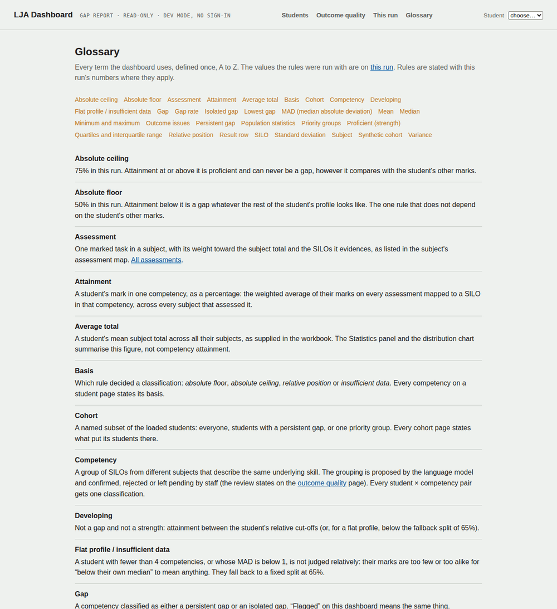{height=15cm}

*Figure 17: The glossary defines every term once, alphabetically, with this run's values where a rule applies.*

Every term used on the dashboard, A to Z with a jump list, MAD with a worked example, and (IOLG-106) *trajectory and subject sequence*, which the gap card's chain links to. Tables and the student page link to it with `?` rather than re-defining terms.

## 22. Typical tasks

| I want to | Go to |
|---|---|
| See who needs attention this week | Students page, 1st-priority tile, then each student's gap cards |
| Explain to a student why they were flagged | Their page, the gap card's evidence table and basis line; the competency page's trace for the outcomes behind it |
| Tell a student where a weakness comes up next, so they can prepare | Their page, the gap card's subject chain: the first chip marked "ahead" (IOLG-106); then the learning plan and study strategy for what to do about it |
| Check that a flag is not an artefact of the settings | Provenance: confirm the thresholds, then the student's basis line (floor is settings-independent; relative depends on MAD) |
| Prepare feedback for a subject coordinator | Outcome quality, the vague and never-assessed lists filtered to their subject |
| Compare two cohorts | Open each in its own dashboard on different ports; the histogram bins are fixed so the shapes compare |
| Find every student weak in one competency | Not possible on one page yet: the Students table's gap columns are counts, so its filter cannot match a competency name, and the competency's page shows classification counts rather than a student list. Use `python -m lja.export` (§10) and filter `competencies.csv` on the competency label and classification. A per-competency student list is a dashboard follow-up. |
| Get the numbers into a spreadsheet | `python -m lja.export` (§10) |

## 23. What the dashboard does not do yet

- No login, no roles, no audit trail. It is a development view and says so in its header.
- Excel input only. A Moodle-sourced run is analysed by the pipeline but is not yet served by the dashboard.
- No dates, so no true time series; "progress" is the declared subject order (IOLG-106), falling back to year level. The default sequence is the three supplied subjects; a real course map from the project owner has not been supplied, so on a larger cohort most subjects are ordered by their year digit and the card says so.
- The subjects "ahead" of a student are inferred from the competency's subjects they have no results in, not from enrolment records or a course map, so on a large cohort they include subjects from other degrees (Part A §4.5). Reading next semester's enrolments from Moodle, or a course map per degree, would make it a fact; neither is built.
- No editing: staff decisions on groups are made with `lja.review`, not in the browser.
- The seven thresholds are unratified defaults (action A-01). Until then, quote the "This run" page with any number.
- The AI review warning says how many groups were rejected but not which (finding UAT-02, 28 September). The pipeline names the rejected group when it stops; the banner does not yet.
- After the quick start in §5.3, the bare `lja.plan`, `lja.strategy` and `lja.export` commands stop with "No clustering cache at output/silo_clustering.json" (finding UAT-01). Pass the same `--clustering-cache` to them, as §9 and §10 show.
- Study strategies are written to files but not shown on the dashboard.
- ⚠ *TO FILL: UAT outcomes and known defects from the 4/5 October review (IOLG-127, IOLG-129).*

---

# Appendices

## Appendix A. Sources and status of the numbers

**Sources.** Chapter 2 follows the system prompt the clustering model runs under and the staff review states in the review tool; the example groups are the model's own output on the 3-subject fixture (CSE1OOF, CSE2ALG, CSE3CAP). Chapters 3 and 4 follow the classification routine and the priority rule in the dashboard; the three students are real rows from the 100-subject, 5,000-student synthetic catalogue run, with attainments and positions as computed there. Part B's options and defaults were read from each command's argument parser and `python/lja/config.py` on `main` at `cd98ce8` (2 October 2026), and for the quiz from the PR #52 branch at `e203da7`; the subject sequence, the chain and the trend band are from the IOLG-106 branch. Part C's screenshots were taken from the IOLG-134 branch at `0d13e10`, which merged unchanged as PR #43 on 30 September, serving the reference run (`data-fixtures/reference-run/`); no screenshot of the quiz section is included yet.

**Status of the numbers.** The seven thresholds in §3.2 are the code defaults, configurable per run and shown on the dashboard's "This run" page. They are proposals with measurements behind them, not ratified values; ratifying or replacing them is open action A-01. The formal definition of every metric, with its formula and where it is calculated and shown, is Appendix B of the System Maintenance Document.

**Figures.** Figures 1 to 5 are rendered from the explainer page "From SILOs to Priority Groups" (29 Sep 2026); Figures 6 to 17 are dashboard screenshots. All are under `docs/handover/diagrams/` as files 11 to 14.

## Appendix B. Open items in this draft

| Where | What is needed | Who |
|---|---|---|
| §8 | Who signs off a cluster review before it drives a staff report; the owner's verdict on Sui Lung's review | Sui Lung, Scott |
| §12 | Production Moodle connection procedure | Ayesha |
| §16 | A screenshot of the quiz section once PR #52 merges, and of a gap card with a subject marked ahead (needs a cohort where students have not sat every subject) | Allan |
| §5.2 | The course map for `LJA_SUBJECT_SEQUENCE`, per degree | Scott |
| §23 | UAT outcomes and known defects from the 4/5 October review (IOLG-127, IOLG-129) | Sui Lung, Ayesha, Anup |
| Part C | Replace reference-run screenshots with the 100-subject cohort, so the pages show a realistic scale | Allan |
| Whole | Read-through by someone who has not seen the dashboard | Scott |

## Appendix C. Change log

| Version | Date | Author | Change |
|---|---|---|---|
| 0.1 | 29 Sep 2026 | Allan Campton (drafted with Claude Code) | First draft: Chapters 1 to 4 from the "From SILOs to Priority Groups" explainer; walkthrough outlined. |
| 0.2 | 30 Sep 2026 | Allan Campton (drafted with Claude Code) | Restructured into Parts A, B and C. Chapters 1 to 4 become Part A, Background. New Part B (producing the data: settings, pipeline, review, plans, export, synthetic cohorts, Moodle) and Part C (every dashboard page with screenshots, typical tasks, limits). Figures sized to stay on one page. Open items listed in Appendix B. |
| 0.3 | 2 Oct 2026 | Allan Campton (drafted with Claude Code) | Brought up to `main` at `cd98ce8`: the IOLG-134 pages merged (PR #43), so their labels are gone. Practice quiz added to §5.2, §9 and §16, marked (PR #52). §8 records the Sprint 5 cluster review and how reviewer files are kept. §10 export table corrected to the real columns. §12 confirms the dashboard has no Moodle source and no workbook export step exists. §22 answers the filter question (it cannot match competency names). §23 adds findings UAT-01 and UAT-02. |
| 0.4 | 2 Oct 2026 | Allan Campton (drafted with Claude Code) | IOLG-106: Part A §4.5 explains the trajectory with a worked chart (Figure 5b, STU0834) and the large-cohort caveat; the subject sequence and trend band settings (§5.2), the subject chain on every gap card and how to read it (§16), the subject-order table on This run (§20), the glossary entry (§21), a typical task (§22) and the limits (§23). Marked (IOLG-106); ships on that branch. |
